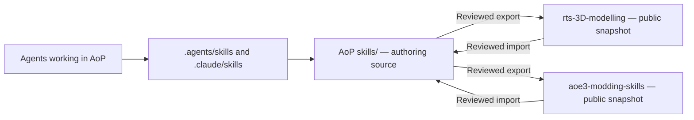

# Skill system architecture

This is the maintainer's overview of the implemented skill system. Keep it in Age of
Pirates (AoP). It covers AoP and both public repositories; it is not itself exported.
For agent setup and compatibility, see [Shared agent setup](agent-skills.md).

The [one-library research](skill-library-research.md) proposes replacing discovery
junctions with a physical shared skill tree and a local Claude plugin. That proposal
has not been migrated; the implementation described below remains current.

## Source of truth

**Author skills in AoP `skills/<name>/SKILL.md`.** All AoP, Blender and reusable AoE3DE
skills live there. Public repositories receive selected, reviewed snapshots.
Outside contributions can be reviewed and imported back into AoP.

Inside each checkout there is one physical skill directory. `.agents/skills` and
`.claude/skills` are filesystem links to it, not independently maintained copies.
Expanding either link in an editor displays the same files.



Each public checkout has its own `skills/` and discovery links for its consumers.
Copies between independent repositories are intentional release snapshots. Copies
between agents in the same checkout are unnecessary and must not be created.

## Repositories and ownership

| Repository / sync target | Purpose | Currently exported packages |
| --- | --- | --- |
| Age of Pirates | Complete authoring suite, mod policy, private workflows and examples | Canonical source; not a public skill pack |
| [rts-3D-modelling](https://github.com/rostislavpeska/rts-3D-modelling), `architecture` | Reusable architectural modeling and texturing | `blender-architecture`, `blender-architecture-texturing` |
| [aoe3-modding-skills](https://github.com/rostislavpeska/aoe3-modding-skills), `aoe3de` | Reusable AoE3DE modding workflows | `aoe3de-bar-archives`, `aoe3de-building-export` |

The public repositories are separate Git checkouts outside AoP, not submodules or
nested repositories. Local folder names may differ from GitHub names. The current
local names are `architecture-blender-skills` and `aoe3de-modding-skills`; only the
device configuration determines their locations.

| Content | Maintained in | Transfer behavior |
| --- | --- | --- |
| Skill instructions, references and bundled helpers | AoP `skills/` | Only allowlisted packages are synchronized |
| Shared project rules | AoP `AGENTS.md` | Never exported as public project rules |
| Discovery helper, user installer, setup guide, instruction import stubs | AoP files mapped in `supportFiles` | Synchronized to both public repos |
| Public README, AGENTS.md, LICENSE, contribution docs and CI | Each public repository | Not managed by the synchronizer |
| Device paths, local tool configuration, MCP connections | Each device / agent | Not exported |
| This architecture document and AoP feedback | AoP | Not exported |

The authoritative export list and shared-file mapping live in
[`scripts/skill-sync-manifest.json`](../scripts/skill-sync-manifest.json).
Update the table above if that manifest changes. The exporter does not automatically
include a new package just because it exists in `skills/`.

## Portable workflows and AoP policy

Use a reusable package for common mechanics and an AoP entry skill for mod-specific
policy and evidence. For example:

- `bar-extract` routes AoP archive work to the shared `aoe3de-bar-archives` helpers.
- `aoe-building-pipeline` adds AoP conventions to `aoe3de-building-export`.
- Blender geometry and texturing are maintained in the two reusable Blender packages.

Keep the shared implementation in one place. Label AoP examples as examples, and
keep local paths, private procedures and mod policy in the AoP layer. A public
package must not require an unexported AoP skill to work.

Export is an allowlist-based copy, **not automatic sanitization or rewriting**.
Files inside an approved package are transfer candidates, apart from ignored cache
files. Curate public-safe content in AoP before exporting; keep private additions
outside those packages. Local-only `skills/gxo-convert/` and
`scripts/havok/converter.local.json` remain ignored machine setup.

## How agents find the same content

The setup helper creates `.agents/skills` and `.claude/skills` pointing at `skills/`.
On Windows these are directory junctions; elsewhere they are relative symlinks.
The links are ignored by Git and must be created for each clone or worktree.

Codex, Cursor, Gemini CLI and VS Code Copilot use the `.agents` discovery path;
Claude Code uses `.claude`. Shared instructions live in `AGENTS.md`.
`CLAUDE.md` and `GEMINI.md` are small imports of that file, not duplicate policy.
See the [setup guide](agent-skills.md) for the compatibility table and official sources.

There is no extra `.codex/skills`, `.cursor/skills` or `.gemini/skills` mirror.
Start the agent in the intended repository and load only relevant skills and
references. Discovering a skill does not establish an MCP connection, install a
converter, select the correct Blender session or grant application permissions.

## Configuration and synchronization state

| File in AoP | Role |
| --- | --- |
| [`config/skill-sync.example.json`](../config/skill-sync.example.json) | Portable template for device setup |
| `config/skill-sync.local.json` | Gitignored absolute paths under `repositories.architecture` and `repositories.aoe3de` |
| [`scripts/skill-sync-manifest.json`](../scripts/skill-sync-manifest.json) | Allowed packages and shared-file source/destination mapping |
| [`scripts/skill-sync-state.json`](../scripts/skill-sync-state.json) | Last synchronized content hashes, separately per target and item |
| [`scripts/tools/public_skill_sync.py`](../scripts/tools/public_skill_sync.py) | Status, export and import implementation |

Version the manifest, synchronizer and synchronization state together in AoP.
Carry that state with AoP to another device; recreate only the ignored path config.
The baseline is a content hash, not a Git commit, backup or proof of publication.
Neither direction fetches, pulls, clones, commits or pushes any repository.

## Normal workflow

1. Work in AoP. Edit the relevant canonical skill after a lesson is demonstrated.
2. Run the relevant validation and a small representative check. Inspect the diff.
3. When ready to share, preview an export to the intended public checkout.
4. Review the actual content, including bundled scripts and any removed files.
   Apply the export, validate the destination, then commit/publish separately as authorized.
5. For an outside contribution, review the public Git changes and import them into
   AoP through the same checks. Re-test the imported workflow.

From the AoP root, these commands only report or preview:

```bash
python -B scripts/tools/setup_agent_skill_link.py --check
python -B scripts/tools/public_skill_sync.py status --target all
python -B scripts/tools/public_skill_sync.py export --target architecture
python -B scripts/tools/public_skill_sync.py import --target aoe3de
```

An export or import changes files **only with `--write`**. For a reviewed export:

```bash
python -B scripts/tools/public_skill_sync.py export --target architecture --write
```

Use `import --target aoe3de --write` for a reviewed incoming AoE3DE change.
The [export skill](../skills/public-skill-export/SKILL.md) and
[import skill](../skills/public-skill-import/SKILL.md) are the task entry points.
Export refreshes local checkouts; publishing to GitHub remains a separate action.

Shared setup files also participate in both directions. After importing a shared
helper from one public repo, review/export its resulting AoP version to the other.
Repository-specific public instructions are deliberately excluded.

## Conflict handling and limits

| Reported state | Meaning | Allowed next step |
| --- | --- | --- |
| `equal` | Both contents match | No copy needed; a write run can refresh the baseline |
| `aop-ahead` | Only AoP differs from baseline | Reviewed export |
| `public-ahead` | Only the public copy differs | Reviewed import |
| `conflict` | Both differ from baseline and each other | Stop and reconcile deliberately |
| `untracked-equal` | Contents match but no baseline exists | A write run records the initial baseline |
| `untracked-different` | Contents differ without a common baseline | Stop; establish which changes should survive |

Wrong-direction transfers are refused. There is no force flag or automatic merge.
Merely merging into AoP does not clear a conflict while the public copy still
differs: the normal CLI will continue to refuse. Baseline reconciliation is a
maintenance task requiring preservation and review of both versions; do not delete
the state file to force an overwrite.

Other practical limits of the current implementation:

- Both configured repositories must be valid, even when selecting one target.
  Each needs a `.git` entry and a `skills/` directory.
- A new skill requires deliberate onboarding: both package directories must exist
  and validate. Adding its name to the manifest alone does not bootstrap it.
- Sync replaces a whole selected package, so deleted files in the source are
  deleted in the destination too. Inspect the preview.
- Writes happen item by item. A later refusal can leave earlier items updated.
  A nonzero exit after `--write` does not mean nothing changed.
- Package replacement uses temporary staging and rollback for the rename step.
  It is not a transaction across all packages/repos, and no permanent backup is kept.
  After interruption, preserve and inspect `.sync-new` / `.sync-old` remnants
  and working-tree diffs before retrying; a package retry removes old staging remnants.
  A crash before the final state write can leave contents and baseline out of sync.
- The scan rejects known private path patterns, listed binary/source formats and
  symbolic links. It is not an exhaustive secret, licensing or code-safety review.
- Public repositories can lag behind AoP intentionally. Nothing silently synchronizes
  or overwrites a contributor's edits.

Compared with a single private skills folder, the extra work is device path setup,
explicit release/import review and occasional conflicts. Daily authoring remains
in one place. There is no background synchronization service or second local
authoring suite to remember.

## Another device or a fresh clone

1. Clone AoP and the two public repos into separate folders.
2. Copy `config/skill-sync.example.json` to `config/skill-sync.local.json` and
   set both paths for that machine. Do not commit the local config.
3. In AoP run `python scripts/tools/setup_agent_skill_link.py`, then `--check`.
4. In each public repo run `python scripts/setup_repo_skill_links.py`, then
   `--check`. These create links, not content copies.
5. Run sync `status` before any write. Open fresh agent sessions in the intended
   checkout and verify discovery. Configure required tools/MCP separately.

The helper refuses existing copied folders or unexpected/broken links. Inspect
them instead of overwriting them. After relocating a Windows checkout, remove only
the obsolete junction itself before recreating it; never recursively delete through
a discovery link.

Older AoP commits tracked files under `.claude/skills`. Do not restore those paths
through the current junction: a historical write can reach the canonical source.
Inspect old skill history in a separate checkout instead.

Optional public consumer installation links individual skills into user-level
discovery folders; see the setup guide. It is unnecessary for repository-local use.
Do not install public snapshots globally over the maintainer's AoP skill names:
that can create ambiguous or stale discovery.

## Testing and feedback

Use three distinct checks; do not describe one as proof of all three:

1. **Structure and scripts:** validate package metadata, links, sync directions,
   refusal paths and helpers. AoP fixture tests are in
   [`test_skill_layout.py`](../scripts/tools/test_skill_layout.py) and
   [`test_public_skill_sync.py`](../scripts/tools/test_public_skill_sync.py).
   Run them with `python -B -m unittest discover -s scripts/tools -p test_skill_layout.py`
   and the same command with `test_public_skill_sync.py`.
   These tests create temporary fixtures, so they are not a strict no-write audit.
2. **Native discovery:** a fresh agent lists the intended skills and source paths,
   with no unintended duplicate names. Then explicitly invoke a harmless skill.
   File identity alone cannot prove activation in an agent.
3. **Behavior:** try one representative task, with scratch assets and a defined
   expected result. Check operator feedback, source preservation, outputs and cost.
   A valid SKILL.md does not prove good UVs, reliable exports or safe app behavior.

Public repos provide `python -B scripts/validate_skills.py` and
`python -B scripts/setup_repo_skill_links.py --check`; their CI runs structural
checks and link setup. CI does not prove Blender/Photoshop or in-game outcomes.

On 2026-09-22 native metadata checks discovered 41 AoP packages and two in each
public repo in Claude Code and Codex. This was discovery evidence, not paid model
execution or a behavior test. Cursor, Gemini and Copilot runtime discovery was not
tested in that check; see [feedback](../skills/FEEDBACK.md) for the recorded assessment.

For a strict dry-run audit, use read-only commands, compare before/after hashes and
Git status, and inspect write logic without executing it. Report actual writes as
**untested**. Do not run fixture tests, setup without `--check`, or sync with
`--write` under a no-write instruction.

Record concrete failures and evidence in [`skills/FEEDBACK.md`](../skills/FEEDBACK.md):
task, expected/actual behavior, affected skill, cost, and smallest proposed fix.
Treat feedback as findings to verify, not automatic instructions. Fix the relevant
canonical instruction or helper, reproduce the failure with a small check, and
export only once the improvement is supported. Preserve useful operator feedback;
avoid adding a new framework or mandatory long audit for every minor edit.
