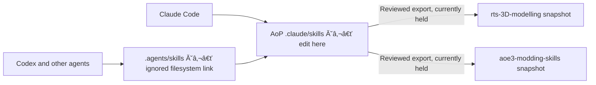

# Skill system architecture

This is the maintainer's overview of the implemented skill system. Keep it in Age of
Pirates (AoP). It covers AoP and both public repositories; it is not itself exported.
For agent setup and compatibility, see [Shared agent setup](agent-skills.md).

## Source of truth

**Edit skills in AoP `.claude/skills/<name>/SKILL.md`.** This is the physical,
tracked library for Claude, Codex and the other supported agents. It includes all
44 current skills, their references, scripts and resources. Claude is the primary
authoring agent; Codex uses the same files for 3D work and other tasks.

Claude Code discovers that directory directly. `.agents/skills` is a single ignored
directory link to it for Codex, Cursor, Gemini CLI and VS Code Copilot. Creating or
editing a skill through either path changes the same file, including newly created
skill directories. No top-level `skills/`, generated instruction copies, forwarding
skill bodies, local marketplace or plugin registration is needed in AoP.



The user approved this Claude-first layout on 2026-09-22, superseding the plugin
proposal in [the earlier research](skill-library-research.md) and
[handoff](skill-library-refactor-handoff.md). Those documents remain historical evidence.
The headless Claude plugin tests do not prove Desktop UI activation; the actual UI
probe failed. This implementation avoids that registration path entirely.

Both local public checkouts now use physical `.claude/skills` plus a generated,
ignored `.agents/skills` link. Their legacy trees were moved after verified backups.
Local exports include the dependency closure: three packages in 3D and four in
modding. These changes are not yet published to GitHub. Copied reference provenance
still needs review before publication. Public consumers edit their own canonical
checkout; the maintainer imports reviewed contributions into AoP before re-export.

## Repositories and ownership

| Repository / sync target | Purpose | Currently exported packages |
| --- | --- | --- |
| Age of Pirates | Complete authoring suite, mod policy, private workflows and examples | Canonical source; not a public skill pack |
| [rts-3D-modelling](https://github.com/rostislavpeska/rts-3D-modelling), `architecture` | Reusable architectural modeling and texturing | `blender-architecture`, `blender-architecture-texturing`, `skill-library-audit` |
| [aoe3-modding-skills](https://github.com/rostislavpeska/aoe3-modding-skills), `aoe3de` | Reusable AoE3DE modding workflows | `aoe3de-bar-archives`, `aoe3de-building-export`, `aoe3de-reference`, `skill-library-audit` |

The public repositories are separate Git checkouts outside AoP, not submodules or
nested repositories. Local folder names may differ from GitHub names. The current
local names are `architecture-blender-skills` and `aoe3de-modding-skills`; only the
device configuration determines their locations.

| Content | Maintained in | Transfer behavior |
| --- | --- | --- |
| Skill instructions, references and bundled helpers | AoP `.claude/skills/` | Only allowlisted packages are synchronized |
| Shared project rules | AoP `AGENTS.md` | Never exported as public project rules |
| Discovery helper, user installer, setup guide, instruction import stubs | AoP files mapped in `supportFiles` | Synchronized to both public repos |
| Public README, AGENTS.md, LICENSE, contribution docs and CI | Each public repository | Not managed by the synchronizer |
| Device paths, local tool configuration, MCP connections | Each device / agent | Not exported |
| This architecture document and AoP feedback | AoP | Not exported |

The authoritative export list and shared-file mapping live in
[`scripts/skill-sync-manifest.json`](../scripts/skill-sync-manifest.json).
Update the table above if that manifest changes. The exporter does not automatically
include a new package just because it exists in `.claude/skills/`.

## Portable workflows and AoP policy

Use a reusable package for common mechanics and an AoP entry skill for mod-specific
policy and evidence. For example:

- `bar-extract` routes AoP archive work to the shared `aoe3de-bar-archives` helpers.
- `aoe-building-pipeline` adds AoP conventions to `aoe3de-building-export`.
- Blender geometry and texturing are maintained in the two reusable Blender packages.

Keep the shared implementation in one place. Label AoP examples as examples, and
keep local paths, private procedures and mod policy in the AoP layer. A public
package must not require an unexported AoP skill to work.

Export is an allowlist-based copy, **not automatic sanitization or rewriting**.
Files inside an approved package are transfer candidates, apart from ignored cache
files. Curate public-safe content in AoP before exporting; keep private additions
outside those packages. Local-only `.claude/skills/gxo-convert/` and
`scripts/havok/converter.local.json` remain ignored machine setup.

## Resource completeness and reference ownership

A portable skill must carry its required instructions, examples and helper source,
or declare an available dependency that carries them. A valid `SKILL.md` and a
successful metadata test do not establish this. Check instructions, referenced
documents, script imports, data files and transitive dependencies together.

Distinguish four kinds of resource:

| Kind | Where it belongs | What counts as available |
| --- | --- | --- |
| Required documentation and helper source | The owning skill's `references/`, `scripts/` or `assets/` | Exists in the exported package; all required local references resolve |
| Shared reusable knowledge | An explicitly declared companion skill package | Included in the target library and installed with the consuming skill |
| Consumer data and examples | The consuming mod, with requirements stated in the skill | Supplied by that mod; a named AoP example is not a portable prerequisite |
| Applications, game archives, licenses and connections | The user's machine or account | Checked for the selected operation using the local-tool procedure below |

Keep one editable source for each reference. When moving a document into a skill,
update its callers and leave a short forwarding page at its old documentation path
when needed. Do not maintain two independently editable full copies. Exported
snapshots in separate repositories remain intentional copies.

Large references should be linked with their purpose and useful search terms, not
loaded wholesale for every task. Record attribution, source URL when known, document
date, game/tool version where known, and whether statements are documented,
measured or unverified. A source that says "all functions" is not proof of coverage
of the current game build. Preserve third-party attribution and check redistribution
terms before publication; the repository's MIT license does not establish rights
to third-party manuals.

### Reference packaging work identified on 2026-09-22

The working AoP library now contains `aoe3de-reference` and `skill-library-audit`.
The four shared reference texts have one maintained home in the reference package;
old documentation paths forward there, and AoP-specific XML observations remain
in the original documentation file. Curated map/trigger and runtime XML summaries
are included. Both new packages are now allowlisted and exported locally as required companions.
GitHub publication has not occurred. Provenance notes retain unresolved
redistribution questions. The table
below records the resource treatment, including helper extraction still pending.

| Existing AoP resource | Planned reusable treatment |
| --- | --- |
| `docs/data_xml_guide.md` | Package XML semantics with provenance; separate AoP occurrence counts, ids and unverified executable observations from portable guidance |
| `docs/rm_commands_reference.md` | Package the RM function reference; reconcile its coverage claims and retain version limitations |
| `docs/ai_reference.xs` | Package as reference text, not an executable map; preserve the community attribution and version warning |
| `docs/command_list.md` | Package UI-command reference with its coverage and provenance limitations |
| `docs/random_map_generation_guide_v2.md`, `docs/map_trigger_guide.md` | Curate reusable map/trigger guidance; keep AoP deployment paths, factions and worked maps in the AoP layer |
| `scripts/havok/`, `scripts/mapcheck/`, `scripts/refdata/`, `sandbox/census/` | Follow imports and required data before selecting reusable helpers; do not export whole directories or private artifacts by default |

The current two public AoE3DE packages have their directly linked local resources,
but the building workflow still needs an explicit GR2 inspection capability for
its required structural validation. Its converter wrapper checks only the header
and file size. Do not report complete building validation until the required
inspector and evidence are available.

## Local application prerequisites

Skills contain procedures and wrapper source; they do not contain installed
Blender, Photoshop, Resource Manager, the game, GR2 converter binaries, licenses,
plugins or running MCP servers. Installation, discoverability, connection and
task readiness are separate facts. Copying a skill does not establish any of them.

Describe prerequisites per operation, including whether an alternative is allowed:

| Operation | Local prerequisites and read-only evidence | Fallback or boundary |
| --- | --- | --- |
| Blender geometry/UV work | Installed Blender; supported operator or automation route; confirm version, active file, scene and target objects | Saved-file/background inspection cannot establish live unsaved state |
| Layered Photoshop edits | Installed/licensed Photoshop when PSD fidelity is required; confirm active document, unsaved state and required layer/export capabilities | An agreed alternative must preserve the source; a flattened image is not a PSD replacement |
| Painter work | Installed Painter plus a compatible, connected integration if automating; inspect project and texture sets | Use the documented Blender/image-editor fallback only when it fits the requested task |
| BAR/XMB inspection | Python, installed game archives and any required Python modules; verify paths and a narrow read-only archive listing | Bundled BAR helpers can satisfy this operation without a GUI Resource Manager |
| Resource Manager workflow | Identify the exact product/version and required format operation, then check its installation and operator/automation route | "Resource Manager" alone is not a sufficient executable or capability specification |
| FBX to GR2 conversion | Locally installed converter with the wrapper's observed command interface; explicit executable path; verified target profile | A GUI-only/different converter requires its own procedure or manual handoff |
| GR2 structural inspection | Reader that exposes actual meshes, bones, bindings and bounds for the output format | A converter success code or recognized header is insufficient |
| Texture validation | The chosen Python interpreter and Pillow for the bundled TGA/DDT validator | Document-only work does not need Photoshop or Blender |

Before an operation that depends on an application:

1. Resolve its location from explicit task input, existing device configuration or
   the environment. Keep machine paths and connection details out of public skill
   files. Never store credentials or proprietary binaries in the repository.
2. Check availability without starting or modifying the application. A discovered
   path proves presence only. Confirm the exact product/version when relevant;
   use a documented read-only version probe only if it is safe for that tool.
3. For live automation, inspect the actually available connector and its read-only
   session/document state. Do not infer tool availability from an old skill name,
   a previous machine's setup or an installed application alone.
4. Establish capability for the selected operation. Record `available`, `missing`,
   `incompatible`, `unverified`, or `not-required`, with the evidence and blocked
   step. Absence of an optional tool does not block unrelated work.
5. Preserve source files and unsaved work before any later mutation. Use a scratch
   output and a known reference for a needed capability test. Do not run document
   macros, Blender embedded scripts or arbitrary probe commands during a resource
   audit. Installation, upgrades and new integrations are separate scoped work,
   not automatic preflight repairs.
6. When a prerequisite is missing, continue independent work and report the exact
   limitation. Use manual export or an already agreed compatible alternative where
   appropriate. Do not silently replace the requested application or claim a
   simulated/background result is a live application result.

Local configuration is an input, not proof of compatibility. Generic instructions
and safe example configuration may be versioned; actual paths and session details
remain ignored device state. Do not create a second configuration system when a
working one already exists. Version ranges should reflect tested evidence; where
none exists, say that compatibility remains unverified.

## Skill-library audit

The [audit skill](../.claude/skills/skill-library-audit/SKILL.md) is implemented in AoP.
It checks resource reachability and reports prerequisites without installing or
launching applications. Six packages have resource declarations: the four existing
public-package sources, the reference library and the audit itself. Other AoP
packages remain explicitly unaudited until their dependencies are declared.
Both public validators and the exporter now audit the release resource closure.
Public CI includes Windows/Linux setup, audit fixtures and reference integrity.

The audit accepts a library root and selected skills, and reports separately:

- **Package integrity:** frontmatter; required local files; Markdown file links;
  referenced script/data resources; declared companion skills and their transitive
  dependencies; unresolved references and links escaping the installed library.
- **Dependency declaration coverage:** each maintained public package needs a small
  machine-readable resource declaration for paths that prose cannot identify
  reliably, conditional prerequisites and external-tool requirements. Legacy AoP
  skills without declarations are reported as unaudited, never silently complete.
- **Machine readiness (optional):** non-executing discovery of configured files,
  executables and Python distributions; application connections and actual
  capabilities remain unverified until their read-only session check is performed.
- **Reference provenance (manual review):** source/version/coverage notes for bundled knowledge;
  web references listed as unchecked unless a separate network check was requested.
  An HTTP success is not evidence that a reference is correct or complete.

Use positive fixtures and failure fixtures: deleted reference, missing companion
skill, transitive missing file, path escape, undeclared dependency, malformed
declaration, unavailable optional application and missing required application.
Audit runs must not launch applications, evaluate commands supplied by manifests,
install dependencies or modify consumer assets. A file-only CI run must work on a
machine without the game or commercial applications. Report which stages were
tested; never label the whole workflow ready because static checks pass.

The 21 initial failure/positive fixtures and the six-package static audit pass.
Machine compatibility and live application connections are not established by them.
New allowlisted packages require explicit `export --onboard`; a missing previously
baselined package remains an error. All selected releases are preflighted before
writes. The XS/XML bundle has LF-normalized SHA-256 checks of its four original
reference texts: these prove integrity, not factual/current-build completeness.

## How agents find the same content

The setup helper creates only `.agents/skills`, pointing at `.claude/skills`.
Windows uses a directory junction; other systems use a relative symbolic link.
The canonical directory must be physical. The helper refuses a second top-level
`skills/` tree and conflicting or broken adapters, without deleting content.
`--check` verifies identity of every discovered SKILL.md without writing.

Both agents create and edit the same library. Filesystem resolution introduces no
extra model-directed instruction-loading step; overall agent speed has not been
benchmarked. Session skill catalogs can still require refresh after adding skills.

Shared rules remain in `AGENTS.md`, imported by `CLAUDE.md` and `GEMINI.md`.
Do not add `.codex/skills`, `.cursor/skills` or `.gemini/skills` mirrors. Perform Git
operations on canonical paths. Do not restore old tracked trees into a live alias
or recursively delete through the adapter. File operations through the link really
do change the canonical source; it is not a backup or an isolated workspace.
See [agent setup](agent-skills.md) for setup and verification.

Discovery does not install applications, connect MCP servers or grant permissions.

## Configuration and synchronization state

| File in AoP | Role |
| --- | --- |
| [`config/skill-sync.example.json`](../config/skill-sync.example.json) | Portable template for device setup |
| `config/skill-sync.local.json` | Gitignored absolute paths under `repositories.architecture` and `repositories.aoe3de` |
| [`scripts/skill-sync-manifest.json`](../scripts/skill-sync-manifest.json) | Allowed packages and shared-file source/destination mapping |
| [`scripts/skill-sync-state.json`](../scripts/skill-sync-state.json) | Last synchronized content hashes, separately per target and item |
| [`scripts/tools/public_skill_sync.py`](../scripts/tools/public_skill_sync.py) | Status, export and import implementation |

Version the manifest, synchronizer and synchronization state together in AoP.
Carry that state with AoP to another device; recreate only the ignored path config.
The baseline is a content hash, not a Git commit, backup or proof of publication.
Neither direction fetches, pulls, clones, commits or pushes any repository.

## Normal workflow

1. Work in AoP. Edit the relevant canonical skill after a lesson is demonstrated.
2. Run the relevant validation and a small representative check. Inspect the diff.
3. When ready to share, preview an export to the intended public checkout.
4. Review the actual content, including bundled scripts and any removed files.
   Apply the export, validate the destination, then commit/publish separately as authorized.
5. For an outside contribution, review the public Git changes and import them into
   AoP through the same checks. Re-test the imported workflow.

From the AoP root, these commands only report or preview:

```bash
python -B scripts/tools/setup_agent_skill_link.py --check
python -B scripts/tools/public_skill_sync.py status --target all
python -B scripts/tools/public_skill_sync.py export --target architecture
python -B scripts/tools/public_skill_sync.py import --target aoe3de
```

An export or import changes files **only with `--write`**. For a reviewed export:

```bash
python -B scripts/tools/public_skill_sync.py export --target architecture --write
```

Use `import --target aoe3de --write` for a reviewed incoming AoE3DE change.
The [export skill](../.claude/skills/public-skill-export/SKILL.md) and
[import skill](../.claude/skills/public-skill-import/SKILL.md) are the task entry points.
Export refreshes local checkouts; publishing to GitHub remains a separate action.

Shared setup files also participate in both directions. After importing a shared
helper from one public repo, review/export its resulting AoP version to the other.
Repository-specific public instructions are deliberately excluded.

## Conflict handling and limits

| Reported state | Meaning | Allowed next step |
| --- | --- | --- |
| `equal` | Both contents match | No copy needed; a write run can refresh the baseline |
| `aop-ahead` | Only AoP differs from baseline | Reviewed export |
| `public-ahead` | Only the public copy differs | Reviewed import |
| `conflict` | Both differ from baseline and each other | Stop and reconcile deliberately |
| `untracked-equal` | Contents match but no baseline exists | A write run records the initial baseline |
| `untracked-different` | Contents differ without a common baseline | Stop; establish which changes should survive |

Wrong-direction transfers are refused. There is no force flag or automatic merge.
Merely merging into AoP does not clear a conflict while the public copy still
differs: the normal CLI will continue to refuse. Baseline reconciliation is a
maintenance task requiring preservation and review of both versions; do not delete
the state file to force an overwrite.

Other practical limits of the current implementation:

- Only selected repositories are validated. Each needs `.git` and physical
  `.claude/skills`; remaining legacy `skills/` trees are refused.
- New packages require allowlisting and `export --onboard`, without a prior baseline.
  Omitted companion resources refuse export before any writes.
- Sync replaces a whole selected package, so deleted files in the source are
  deleted in the destination too. Inspect the preview.
- Writes happen item by item. A later refusal can leave earlier items updated.
  A nonzero exit after `--write` does not mean nothing changed.
- Package replacement uses temporary staging and rollback for the rename step.
  It is not a transaction across all packages/repos, and no permanent backup is kept.
  After interruption, preserve and inspect `.sync-new` / `.sync-old` remnants
  and working-tree diffs before retrying; a retry refuses existing staging remnants until they are reviewed.
  A crash before the final state write can leave contents and baseline out of sync.
- The scan rejects known private path patterns, listed binary/source formats and
  symbolic links. It is not an exhaustive secret, licensing or code-safety review.
- Public repositories can lag behind AoP intentionally. Nothing silently synchronizes
  or overwrites a contributor's edits.

Compared with a single private skills folder, the extra work is device path setup,
explicit release/import review and occasional conflicts. Daily authoring remains
in one place. There is no background synchronization service or second local
authoring suite to remember.

## Another device or a fresh clone

1. Clone AoP. Edit skills only in `.claude/skills/`.
2. Run `python scripts/tools/setup_agent_skill_link.py`, then repeat with `--check`.
   Claude needs no adapter; the command creates the Codex/shared discovery link.
3. Open a fresh agent session in that checkout. Skill activation remains a host check.
4. Configure tool connections and ignored device paths separately. If using public
   sync, initialize `config/skill-sync.local.json` from its example and run status.
   Public checkouts now use the same layout; publication remains separate.

Repeat setup in each worktree: the link must resolve to that worktree's physical
library. Windows junctions use absolute paths; relocating a checkout needs explicit
repair of the verified link entry. The helper never replaces a conflicting path.
No global installation is needed for AoP. Optional user-scope installation is intended
for public consumers, not for shadowing the maintainer's repository skills.

## Testing and feedback

Use three distinct checks; do not describe one as proof of all three:

1. **Structure and scripts:** validate package metadata, links, sync directions,
   refusal paths and helpers. AoP fixture tests are in
   [`test_skill_layout.py`](../scripts/tools/test_skill_layout.py) and
   [`test_public_skill_sync.py`](../scripts/tools/test_public_skill_sync.py).
   Run them with `python -B -m unittest discover -s scripts/tools -p test_skill_layout.py`
   and the same command with `test_public_skill_sync.py`.
   These tests create temporary fixtures, so they are not a strict no-write audit.
2. **Native discovery:** a fresh agent lists the intended skills and source paths,
   with no unintended duplicate names. Then explicitly invoke a harmless skill.
   File identity alone cannot prove activation in an agent.
3. **Behavior:** try one representative task, with scratch assets and a defined
   expected result. Check operator feedback, source preservation, outputs and cost.
   A valid SKILL.md does not prove good UVs, reliable exports or safe app behavior.

Public repos provide `python -B scripts/validate_skills.py` and
`python -B scripts/setup_repo_skill_links.py --check`; their CI runs structural
checks and link setup. CI does not prove Blender/Photoshop or in-game outcomes.

On 2026-09-22 native metadata checks discovered 41 AoP packages and two in each
public repo in Claude Code and Codex. This was discovery evidence, not paid model
execution or a behavior test. Cursor, Gemini and Copilot runtime discovery was not
tested in that check; see [feedback](../.claude/skills/FEEDBACK.md) for the recorded assessment.

For a strict dry-run audit, use read-only commands, compare before/after hashes and
Git status, and inspect write logic without executing it. Report actual writes as
**untested**. Do not run fixture tests, setup without `--check`, or sync with
`--write` under a no-write instruction.

Record concrete failures and evidence in [`.claude/skills/FEEDBACK.md`](../.claude/skills/FEEDBACK.md):
task, expected/actual behavior, affected skill, cost, and smallest proposed fix.
Treat feedback as findings to verify, not automatic instructions. Fix the relevant
canonical instruction or helper, reproduce the failure with a small check, and
export only once the improvement is supported. Preserve useful operator feedback;
avoid adding a new framework or mandatory long audit for every minor edit.

## Claude-first migration verification (2026-09-22)

All 122 source files were backed up outside the live mod and hash-verified before
and immediately after the move. Existing grouping-skill edits were carried forward;
unrelated census work and Claude settings/hooks were preserved. Intentional edits
update root-relative commands, Markdown links and helper repository-root calculations.
The allowlist and synchronization baselines were not changed. No public export or
publication was performed by this migration.

Verification passed: 7 layout tests, 4 synchronization tests and 21 resource-audit
fixtures (32 total); metadata validation of all 43 skills; and the six-package
resource audit. The layout fixtures create a skill through the Codex link and edit
it through the Claude source, verifying file identity and content in both directions.
All 122 pre-move files remain present, with 25 intentionally changed for paths/docs.
Export preview succeeded; import preview correctly refused incoming changes in the
wrong direction. Hash comparisons confirmed both previews left public packages,
support files and sync baselines unchanged; both public Git checkouts remain clean.
The resource audit still covers six declared packages, not all 43. The user
reported that a verification Codex task listed both Blender skills but advertised
the removed top-level `skills/` paths, so loading through that metadata failed.
Reading the canonical skill and its construction reference succeeded, and all seven
layout tests passed. This establishes filesystem/resource access, not successful
native loading. Stale host metadata is suspected; its refresh remains unresolved.
No model-speed claim or fresh Claude Desktop UI success is inferred from these tests.

## Public portability follow-up (2026-09-22)

Both local public checkouts migrated to the Claude-first layout and received reviewed
local exports through the updated synchronizer. The 3D release has geometry,
texturing and audit packages. Modding has BAR/XMB, building export, reference and
audit packages. Setup, metadata/resource validation and extraction from ZIP without
Git passed on this Windows device. Public tests passed: 23 in 3D, 27 in modding.
Export/import previews both returned success with unchanged repository and baseline
hashes. CI now specifies Windows and Linux; hosted CI has not run for these changes.
Fresh native agent discovery and installed application operation remain unverified.

All four original reference texts match their recorded packaged hashes and the
normalized historical source scope (including the XML guide's pre-Placement Rules
boundary). Modding now bundles 2,454 lines of XS/AI reference, 883 lines of RM commands,
2,146 lines of shared XML documentation and 82 lines of UI commands, plus the curated
runtime XML/map-trigger summaries. These are inclusion counts, not an exhaustive
current DE function/attribute inventory. Original raw hashes reflect working-copy
line endings; LF-normalized hashes enable portable integrity checks.

Changes are local and uncommitted; no public GitHub push was performed. Before
publishing copied reference texts, resolve the provenance/redistribution notes.
Application binaries, local tool paths and private AoP wrappers were not exported.
