# Visual Interpretation Library for AI Agents

**Purpose:** Help AI agents recognize terrain types, game elements, and objects through visual analysis.

---

# **CHAPTER 1: MINIMAP ANALYSIS**

## **🎯 MINIMAP ANALYSIS PROCESS**

### **Critical Rule: COLOR FIRST, INTERPRETATION SECOND**

**❌ WRONG Approach:**
- "This looks like water" → assume it's water
- "This seems like a lake" → call it navigable
- Rely on shape/context before verifying color

**✅ CORRECT Approach:**
1. **Identify the color** → Extract RGB value
2. **Match to library** → Find exact color in this document
3. **Verify terrain type** → Use documented terrain category
4. **Confirm with context** → Does it make sense?

---

### **📋 Step-by-Step Analysis Checklist:**

**Step 1: SCAN COLORS**
- Identify all unique colors present on minimap
- Don't assume - measure/observe actual colors

**Step 2: MATCH LIBRARY**
- Compare each color to visual_interpretation_library.md
- Use exact RGB values, not approximations

**Step 3: MAP TERRAIN**
- Label each area by verified color match
- Water = `#4C6091` ONLY (not similar blues!)
- Ice = `#5f7e93` (grey-blue, NOT water!)

**Step 4: IDENTIFY ELEMENTS**
- Resources (gold, hunts, fish)
- Players (colored stars)
- Trade routes (white lines)
- Native settlements

**Step 5: DESCRIBE PATTERN**
- Overall map layout
- Strategic features
- Gameplay implications

**Step 6: VERIFY LOGIC**
- Does the interpretation make sense?
- Are there contradictions?
- Double-check ambiguous colors

---

### **⚠️ Common Mistakes to Avoid:**

**1. Water vs Ice Confusion**
- ❌ "Blue area = water"
- ✅ Check if it's `#4C6091` (water) or `#5f7e93` (ice)
- Ice can form lake shapes but is impassable!

**2. Assuming Based on Shape**
- ❌ "Lake-shaped = navigable water"
- ✅ Verify color code first
- Frozen lakes look like water but aren't!

**3. Ignoring the Color Library**
- ❌ Making up terrain types
- ✅ Use only documented colors from this file

**4. Context Over Color**
- ❌ "It's near water, so it must be beach"
- ✅ Match the exact RGB value first

---

### **🧠 Mental Verification Questions:**

**Before declaring "WATER":**
- ✅ Does the color match `#4C6091` exactly?
- ✅ Is it darker than ice `#5f7e93`?
- ✅ Are there fish icons (grey diamonds)?
- ✅ Does the map support naval gameplay?

**Before declaring "ICE/GLACIER":**
- ✅ Does the color match `#5f7e93` (grey-blue)?
- ✅ Is it lighter/greyer than water?
- ✅ Is it in arctic/frozen context?
- ✅ Does it form boundaries or obstacles?

---

## **BASIC COLOR RECOGNITION GUIDE**

### **Reference Images:**

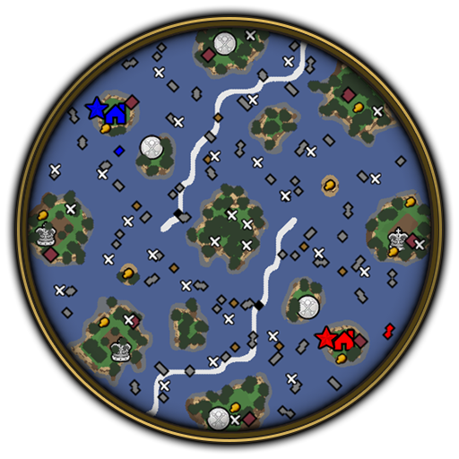
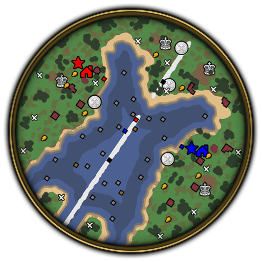
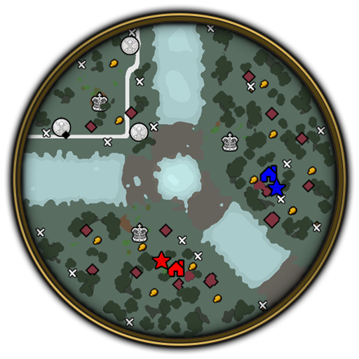

---

## **TERRAIN COLORS - BASE TYPES**
*(Extracted from terraintypes.xml - Exact RGB values)*

### 🌊 **WATER** = `rgb(76, 96, 145)` = `#4C6091`
<div style="background-color: #4C6091; width: 200px; height: 40px; border: 2px solid black; display: inline-block;"></div>

- **Type:** "Water"
- **mapcolor_name:** "Water"
- Medium-dark blue
- Solid ocean color on minimaps
- **See:** Ocean in archipelago map

---

### 🏖️ **SHORELINE/BEACHES** = `rgb(233, 228, 143)` = `#E9E48F`
<div style="background-color: #E9E48F; width: 200px; height: 40px; border: 2px solid black; display: inline-block;"></div>

- **Type:** "Shoreline"
- Light yellow-beige/sandy color
- Border between land and water
- **See:** Beaches around Hawaii islands

---

### 💧 **UNDERWATER/SHALLOW** = `rgb(179, 177, 152)` = `#B3B198`
<div style="background-color: #B3B198; width: 200px; height: 40px; border: 2px solid black; display: inline-block;"></div>

- **Type:** "Underwater"
- Grey-beige
- Shallow water/coral reefs
- **See:** Underwater ring around Hawaii islands

---

### 🪨 **NON-PASSABLE ROCK** = `rgb(76, 62, 72)` = `#4C3E48`
<div style="background-color: #4C3E48; width: 200px; height: 40px; border: 2px solid black; display: inline-block;"></div>

- **Type:** "NonPassableLand"
- Dark grey-purple
- Impassable cliffs/rocks
- **mapcolor_name:** "Rock"

---

## **TERRAIN SUBTYPES - mapcolor_name Categories**
*(These override base land color - approximate colors)*

### 🌾 **GRASS (Type 1: Pure Grass)** 
<div style="background-color: #6B8E3D; width: 200px; height: 40px; border: 2px solid black; display: inline-block;"></div>

- **mapcolor_name:** "Grass"
- Light to medium green (~`#6B8E3D`)
- Most common land terrain
- Base grassland color
- **See:** Light green areas on maps

---

### 🌳 **FOREST (Type 2: Dark Green)**
<div style="background-color: #2D5016; width: 200px; height: 40px; border: 2px solid black; display: inline-block;"></div>

- **mapcolor_name:** "Forest"
- Dark green (~`#2D5016`)
- Wooded/forested areas
- Darker than regular grass
- **See:** Dark green patches on all maps

---

### 🏜️ **DIRT (Type 3: Brown)**
<div style="background-color: #8B7355; width: 200px; height: 40px; border: 2px solid black; display: inline-block;"></div>

- **mapcolor_name:** "Dirt"
- Brown tones (~`#8B7355`, varies by biome)
- Bare ground, roads, deserts
- No vegetation

---

### 🌿 **GRASS-DIRT (Type 4: Dry Grassland)**
<div style="background-color: #A0935C; width: 200px; height: 40px; border: 2px solid black; display: inline-block;"></div>

- **mapcolor_name:** "Grass-Dirt"
- Yellow-brown-green mix (~`#A0935C`)
- Transitional/dry grassland
- Common in arid/savanna regions
- **See:** Yellowish grass areas

---

### 🏖️ **GRASS-SAND (Type 5: Beach Grass)**
<div style="background-color: #B3B870; width: 200px; height: 40px; border: 2px solid black; display: inline-block;"></div>

- **mapcolor_name:** "Grass-Sand"
- Green-tan mix (~`#B3B870`)
- Coastal grass transitions
- Between grassland and beaches

---

### 🌨️ **GRASS-SNOW (Type 6: Tundra Grass)**
<div style="background-color: #C8D4B8; width: 200px; height: 40px; border: 2px solid black; display: inline-block;"></div>

- **mapcolor_name:** "Grass-Snow"
- Green-white mix (~`#C8D4B8`)
- Cold climate grasslands
- Transition to snow areas

---

### ❄️ **SNOW (Type 7: Pure Snow)**
<div style="background-color: #F5F5F5; width: 200px; height: 40px; border: 2px solid black; display: inline-block;"></div>

- **mapcolor_name:** "Snow"
- White/very light grey (~`#F5F5F5`)
- Brightest terrain
- Arctic/winter maps

---

### 🌫️ **DIRT-SNOW (Type 8: Mixed Snow)**
<div style="background-color: #D0C8C0; width: 200px; height: 40px; border: 2px solid black; display: inline-block;"></div>

- **mapcolor_name:** "Dirt-Snow"
- Grey-white mix (~`#D0C8C0`)
- Partial snow coverage
- Tundra/permafrost

---

### 🏔️ **STONE (Type 9: Grey Stone)**
<div style="background-color: #808080; width: 200px; height: 40px; border: 2px solid black; display: inline-block;"></div>

- **mapcolor_name:** "Stone"
- Grey (~`#808080`)
- Stone/rocky terrain
- Different from impassable rock

---

### 🏖️ **SAND (Type 10: Desert Sand)**
<div style="background-color: #D4B896; width: 200px; height: 40px; border: 2px solid black; display: inline-block;"></div>

- **mapcolor_name:** "Sand"
- Tan/sandy color (~`#D4B896`)
- Desert areas
- Dry, arid terrain

---

### 🧊 **ICE (Type 11: Glacier Ice)**
<div style="background-color: #5f7e93; width: 200px; height: 40px; border: 2px solid black; display: inline-block;"></div>

- **mapcolor_name:** "Ice"
- Light blue-white/cyan (~`5f7e93`)
- **Frozen glaciers/ice sheets** - impassable frozen terrain
- **NOT navigable water** - this is solid ice
- Forms map boundaries on frozen maps
- **See:** Light blue border in Frozen maps, Alps glaciers
- **IMPORTANT:** Easily confused with water (`#4C6091`) but lighter/cyan-tinted

---

### ⬛ **BLACKMAP (Special)**
<div style="background-color: #000000; width: 200px; height: 40px; border: 2px solid black; display: inline-block;"></div>

- **mapcolor_name:** "Blackmap"
- Black (`#000000`)
- Special/hidden areas
- volcano craters
- Rarely used

---

## **RESOURCES & GAME ELEMENTS**

### 🦌 **Hunts / Berries** = `rgb(128, 51, 64)` = `#803340` (Brownish-Red Circles)
<div style="background-color: #803340; width: 200px; height: 40px; border: 2px solid black; display: inline-block;"></div>

- Small circular dots
- Same color for animals and berries (from protomods.xml minimapcolor)
- **From:** `<minimapcolor red="0.5000" blue="0.2500" green="0.2000">`
- **See:** Brownish-red dots on all maps

---

### 🐟 **Fish** = Grey/Brown Diamonds `◆`
<div style="background-color: #696969; width: 200px; height: 40px; border: 2px solid black; display: inline-block;"></div>

- Diamond shaped in water
- Grey color (~`#696969`)
- Darker than water
- **See:** Small diamonds in archipelago water

---

### 💰 **Gold Mines** = `rgb(227, 178, 64)` = `#E3B240` (Golden Yellow Diamonds) `◆`
<div style="background-color: #E3B240; width: 200px; height: 40px; border: 2px solid black; display: inline-block;"></div>

- Golden yellow diamonds
- On land only
- **From:** `<minimapcolor red="0.8900" blue="0.2500" green="0.7000">`
- **See:** Golden yellow diamonds on all maps

---

### 👥 **Players** (Up to 8 Players)

**Player 1 - Blue:**
<div style="background-color: #0000FF; width: 90px; height: 40px; border: 2px solid black; display: inline-block;"></div>

- Color: Blue `#0000FF`
- Icon: Blue star ★

**Player 2 - Red:**
<div style="background-color: #FF0000; width: 90px; height: 40px; border: 2px solid black; display: inline-block;"></div>

- Color: Red `#FF0000`
- Icon: Red star ★

**Player 3 - Yellow:**
<div style="background-color: #FFFF00; width: 90px; height: 40px; border: 2px solid black; display: inline-block;"></div>

- Color: Yellow `#FFFF00`
- Icon: Yellow star ★

**Player 4 - Purple:**
<div style="background-color: #800080; width: 90px; height: 40px; border: 2px solid black; display: inline-block;"></div>

- Color: Purple `#800080`
- Icon: Purple star ★

**Player 5 - Green:**
<div style="background-color: #00FF00; width: 90px; height: 40px; border: 2px solid black; display: inline-block;"></div>

- Color: Green `#00FF00`
- Icon: Green star ★

**Player 6 - Orange:**
<div style="background-color: #FFA500; width: 90px; height: 40px; border: 2px solid black; display: inline-block;"></div>

- Color: Orange `#FFA500`
- Icon: Orange star ★

**Player 7 - Cyan:**
<div style="background-color: #00FFFF; width: 90px; height: 40px; border: 2px solid black; display: inline-block;"></div>

- Color: Cyan/Turquoise `#00FFFF`
- Icon: Cyan star ★

**Player 8 - Pink:**
<div style="background-color: #FF69B4; width: 90px; height: 40px; border: 2px solid black; display: inline-block;"></div>

- Color: Pink `#FF69B4`
- Icon: Pink star ★

**Team Arrangement:**
- **Team 1:** Players 1-4 (Blue, Red, Yellow, Brown)
- **Team 2:** Players 5-8 (Green, Orange, Cyan, Pink)

**On Minimap:**
- All players show as colored stars ★ in their respective colors
- Player positions indicate spawn locations
- Team colors help identify alliances

---

### 🛤️ **Trade Routes** = `#FFFFFF` (White Lines)
<div style="background-color: #FFFFFF; width: 200px; height: 40px; border: 2px solid black; display: inline-block;"></div>

- **Solid white** = Land trade routes
- **Dotted white** = Water trade routes
- **See:** White line on archipelago, X-pattern on land maps

---

## **MINIMAP ICONS & OBJECTS**

### ✖️ **Treasures** (Bonus Resources)


- **Icon:** White X mark (crossed swords/bones pattern)
- **Color:** White/grey
- **Location:** Scattered across land and sometimes water
- **Purpose:** Early game bonus resources (XP, resources, units)
- **Guarded:** Often protected by guardian units
- **Strategic:** High priority in early exploration
- **Appearance:** Distinctive X or crossed pattern
- **IMPORTANT:** NOT to be confused with native settlements!
- **See:** Multiple X marks on Hawaii, scattered on most maps

---

### 💰 **Gold Mines** (Minimap Icon)


- **Icon:** Golden yellow diamond shape ◆
- **Color:** Golden yellow `#E3B240` = `rgb(227, 178, 64)`
- **Location:** On land only
- **Purpose:** Primary gold resource
- **Appearance:** Diamond/gem shape
- **From protomods.xml:** `<minimapcolor red="0.8900" blue="0.2500" green="0.7000">`
- **Strategic:** Essential for economy, high priority control
- **See:** Multiple gold diamonds on all maps

---

### 🐋 **Whales** (Marine Animals)


- **Icon:** Yellow/gold whale symbol
- **Location:** In ocean water
- **Resource:** Huntable marine animal (food)
- **NOT fish** - Whales are larger huntable animals
- **Appearance:** Distinct whale-shaped icon, not a diamond
- **See:** Hawaii map ocean areas

---

### 🏛️ **Native Settlements - Type 1 (Teepee Style)**
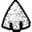

- **Icon:** Triangle/teepee shape with pattern
- **Style:** Native American teepee design
- **Color:** White/grey with black outline
- **Tribes:** Plains tribes (Lakota, Cheyenne, Inuits, Maori, Korowai, Aboriginals, etc.)
- **Appearance:** Pointed top, triangular base

---

### 🏛️ **Native Settlements - Type 2 (religious sites)**


- **Icon:** Rounded hut with roof
- **Style:** Tropical/circular hut design
- **Color:** White/grey with black outline
- **Tribes:** Island/tropical tribes (Jesuit, Shaolin, Maltese, Zen, etc.)
- **Appearance:** Rounded dome or conical roof

---

### 🏛️ **Native Settlements - Type 3 (Palace Style)**


- **Icon:** Multi-tiered building/temple
- **Style:** Complex architectural structure
- **Color:** White/grey with detailed pattern
- **Tribes:** Advanced civilizations (Bourbon, Habsburg, Prince Elector)
- **Appearance:** Layered/stepped pyramid or palace structure

---

### 🏛️ **Native Settlements - Type 4 (College/Academy Style)**


- **Icon:** Graduation cap/mortarboard symbol
- **Style:** Academic/educational building
- **Color:** White/grey with black outline
- **Sites:** Inventor/Scientist sites, Research academies
- **Appearance:** Graduation cap shape, scholarly symbol
- **Purpose:** Technology and invention upgrades

---

### 🏛️ **Native Settlements - Type 5 (Naval/Maritime Style)**


- **Icon:** Anchor symbol
- **Style:** Naval/maritime building
- **Color:** White/grey with black outline
- **Sites:** Naval academies, Pirate havens, Maritime guilds
- **Appearance:** Ship anchor shape
- **Purpose:** Naval upgrades and ship technologies

---


### 🔌 **Trade Route Sockets (Trade Post Sites)**


- **Icon:** Circular socket/medallion symbol
- **Location:** Along trade routes (white lines)
- **Purpose:** Build trade posts here
- **Color:** White/grey circular pattern
- **Appearance:** Decorative circular design
- **Strategic:** Control points for trade route income
- **See:** Along white trade route lines

---

### 🔌 **Trade Route Sockets (Capturable)**


- **Icon:** Circular socket/medallion symbol
- **Location:** Along trade routes (white lines)
- **Purpose:** Capture here
- **Color:** Brown/dark brown circular pattern
- **Appearance:** Decorative circular design
- **Strategic:** Control points for trade route income
- **See:** Along white trade route lines

---

### 🔌 **Neutral building (Capturable)**


- **Icon:** special symbol, f.e. cross for cathedral, but may vary per building type
- **Location:** usually insede praced groupings
- **Purpose:** Capture here
- **Color:** brown
- **Appearance:** various based on building type
- **Strategic:** Capturable neutral production buildings
- **See:** inside groupings or city blocks, ouside groupings very rarely

---

## **ICON IDENTIFICATION GUIDE**

### **How to Distinguish Icons:**

**Treasures:**
- ✖️ **Treasures** = White X mark (crossed pattern)
- **NOT native settlements** - X marks are treasures!
- Early game bonus resources

**Resources:**
- 💰 **Gold Mines** = Golden yellow diamond ◆ `#E3B240`
- 🐋 **Whales** = Yellow whale-shaped icon (larger)
- 🐟 **Fish** = Grey diamond ◆ (smaller)
- 🦌 **Hunts/Berries** = Brownish-red circles `#803340`

**Native Settlement Types:**
- **Type 1 (Teepee)** = Triangle/pointed top - Plains tribes (Lakota, Cheyenne, Inuits, Maori, Korowai, Aboriginals)
- **Type 2 (Religious)** = Round hut/dome - Religious sites (Jesuit, Shaolin, Maltese, Zen)
- **Type 3 (Palace)** = Multi-tiered structure - Royal houses (Bourbon, Habsburg, Prince Elector)
- **Type 4 (College)** = Graduation cap - Inventor/Scientist sites, Research academies
- **Type 5 (Naval)** = Anchor symbol - Naval academies, Pirate havens, Maritime guilds

**Trade Elements:**
- **Trade Route** = White line (solid or dotted)
- **Trade Socket (Build)** = White/grey circular medallion - Build trade posts
- **Trade Socket (Capturable)** = Brown/dark brown circular - Capture to control

**Capturable Buildings:**
- **Neutral Buildings** = Special symbols (e.g., cross for cathedral)
- **Color:** Brown icons
- **Location:** Inside groupings/city blocks
- **Purpose:** Capturable production buildings

---

## **🏔️ CLIFF & EDGE DETECTION GUIDE**

### **Visual Cliff Identification:**

**1. Sharp Color Boundaries:**
<div style="background-color: #4C3E50; width: 90px; height: 40px; border: 2px solid black; display: inline-block; margin-right: 5px;"></div>
<div style="background-color: #8B7355; width: 90px; height: 40px; border: 2px solid black; display: inline-block;"></div>

- **Dark purple-grey** (`#4C3E50`) = Impassable rock/cliffs
- **Medium brown** (`#8B7355`) = Passable dirt/rock
- **Cliff edges** = The **sharp transition line** between these colors
- **Look for:** Abrupt color changes with no gradual blending

**2. Geometric Patterns:**
- **Linear/angular boundaries** - Cliffs form straight or angular lines
- **Elevation contours** - Follow mountain ridge patterns
- **Natural curves** - Cliffs follow terrain contours, not random shapes

**3. Visual Examples:**

**A. Mountain Ridge Pattern (Carpathians):**
- **Central mountain range** - Dark purple cores with brown edges
- **Isolated peaks** - Circular dark spots with defined boundaries
- **Valley walls** - Parallel lines of dark purple bordering valleys

**B. Angular/Linear Pattern (Anatolia):**
- **Sharp angular boundaries** - Purple triangles with defined edges
- **Linear cliff formations** - Straight purple lines with brown borders
- **Geometric shapes** - Angular purple formations, not curved
- **Plateau edges** - Purple borders around elevated areas

---

### **🔍 CLIFF DETECTION ALGORITHM:**

**Step 1: Find Dark Purple Areas**
- Search for `#4C3E50` (NonPassableLand)
- These are the cliff/rock formations

**Step 2: Identify Edge Pixels**
- Look for pixels adjacent to both:
  - Dark purple (`#4C3E50`) = Cliff
  - Brown/green (`#8B7355`/`#6B8E3D`) = Passable terrain

**Step 3: Pattern Recognition**
- **Valid cliff edges:** Form continuous lines/curves
- **Invalid:** Isolated purple pixels (noise)
- **Valid:** Follow natural mountain topology

---

### **📊 COLOR TRANSITION MATRIX:**

| From Color | To Color | Meaning |
|------------|----------|---------|
| <div style="background-color: #4C3E50; width: 60px; height: 25px; border: 1px solid black; display: inline-block;"></div> | <div style="background-color: #8B7355; width: 60px; height: 25px; border: 1px solid black; display: inline-block;"></div> | **Cliff edge** |
| <div style="background-color: #4C3E50; width: 60px; height: 25px; border: 1px solid black; display: inline-block;"></div> | <div style="background-color: #6B8E3D; width: 60px; height: 25px; border: 1px solid black; display: inline-block;"></div> | **Cliff edge** |
| <div style="background-color: #8B7355; width: 60px; height: 25px; border: 1px solid black; display: inline-block;"></div> | <div style="background-color: #6B8E3D; width: 60px; height: 25px; border: 1px solid black; display: inline-block;"></div> | Normal terrain |
| <div style="background-color: #4C3E50; width: 60px; height: 25px; border: 1px solid black; display: inline-block;"></div> | <div style="background-color: #4C6091; width: 60px; height: 25px; border: 1px solid black; display: inline-block;"></div> | Coastal cliffs |

---

### **🎯 KEY INDICATORS:**

**✅ This IS a cliff edge:**
<div style="background-color: #4C3E50; width: 60px; height: 25px; border: 1px solid black; display: inline-block; margin-right: 2px;"></div>
<div style="background-color: #8B7355; width: 60px; height: 25px; border: 1px solid black; display: inline-block;"></div>

**Pattern A (Mountain Ridges - Carpathians):**
- Sharp purple-to-brown boundary
- Forms continuous curved lines
- Follows mountain ridge pattern
- Natural curved shapes

**Pattern B (Angular/Linear - Anatolia):**
- Sharp purple-to-brown boundary  
- Forms straight/angular lines
- Geometric triangular/linear shapes
- Plateau edges and angular formations

**❌ This is NOT a cliff edge:**
<div style="background-color: #4C3E50; width: 60px; height: 25px; border: 1px solid black; display: inline-block; margin-right: 2px;"></div>
<div style="background-color: #6B8E3D; width: 60px; height: 25px; border: 1px solid black; display: inline-block;"></div>

- Gradual color blending
- Isolated purple pixels
- Random angular shapes
- Straight artificial lines

**References:**
- **Carpathians:** Curved mountain ridge patterns with purple cores
- **Anatolia:** Angular/linear cliff formations with geometric shapes

---

## **🧭 MAP COORDINATE SYSTEM**

### **⚠️ Critical: 45° Rotation Between Code and Visual**

**The XZ coordinate system in map scripts is rotated 45° from the visual minimap display!**

---

### **Visual Representation**

**Code Coordinates (XZ Axes):**
```
              Z-axis (North in code)
                     ↑
                (0.5, 1.0)
                     |
(0.0, 0.5) ←────────(0.5, 0.5)────────→ (1.0, 0.5)
   X-axis           |                    X-axis
   (West)           |                    (East)
                    |
               (0.5, 0.0)
                    ↓
              (South in code)
```

**Visual Minimap Display (Diamond Shape):**
```
                    N (North)
                    ↑
               (0.5, 1.0)
                   /|\
                  / | \
                 /  |  \
        (0.0, 1.0) |  (1.0, 1.0)
         W ←───(0.5, 0.5)───→ E
        (0.0, 0.5) |  (1.0, 0.5)
                 \ | /
                  \|/
               (0.5, 0.0)
                    ↓
                    S (South)
```

---

### **Quick Reference: Visual Direction → Code Coordinates**

| Visual Direction | X Range | Z Range | Example Coords |
|-----------------|---------|---------|----------------|
| **North (Top)** | 0.4-0.6 | 0.8-1.0 | `(0.5, 0.9)` |
| **East (Right)** | 0.8-1.0 | 0.4-0.6 | `(0.9, 0.5)` |
| **South (Bottom)** | 0.4-0.6 | 0.0-0.2 | `(0.5, 0.1)` |
| **West (Left)** | 0.0-0.2 | 0.4-0.6 | `(0.1, 0.5)` |
| **Center** | 0.4-0.6 | 0.4-0.6 | `(0.5, 0.5)` |

---

### **Understanding Coordinates in Map Analysis**

When analyzing a minimap and correlating with map script code:

**Visual "North" (Top of minimap):**
- Code uses: **High Z** (0.8-1.0) + **Mid X** (0.4-0.6)
- Example: `(0.5, 0.9)` appears at the **top** of the minimap

**Visual "East" (Right of minimap):**
- Code uses: **High X** (0.8-1.0) + **Mid Z** (0.4-0.6)
- Example: `(0.9, 0.5)` appears on the **right** of the minimap

**Visual "South" (Bottom of minimap):**
- Code uses: **Low Z** (0.0-0.2) + **Mid X** (0.4-0.6)
- Example: `(0.5, 0.1)` appears at the **bottom** of the minimap

**Visual "West" (Left of minimap):**
- Code uses: **Low X** (0.0-0.2) + **High Z** (0.7-1.0)
- Example: `(0.1, 0.85)` appears on the **left** of the minimap

---

### **Coordinate Mapping Table**

| Code Coordinates (X, Z) | Visual Map Position | Description |
|------------------------|---------------------|-------------|
| `(1.0, 1.0)` | **North (Top)** | High X, High Z → Top of diamond |
| `(1.0, 0.0)` | **East (Right)** | High X, Low Z → Right of diamond |
| `(0.0, 0.0)` | **South (Bottom)** | Low X, Low Z → Bottom of diamond |
| `(0.0, 1.0)` | **West (Left)** | Low X, High Z → Left of diamond |
| `(0.5, 0.5)` | **Center** | Mid X, Mid Z → Center |

---

## **📖 EXAMPLE: HOW TO READ A MAP**

### **Case Study: Black Sea Map Analysis**

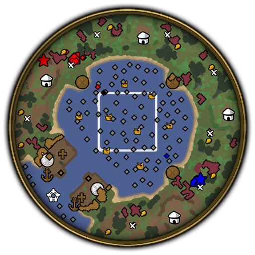

Using this visual interpretation library, here's how to systematically analyze a minimap:

**Step 1: Identify Water Areas**
- **Central blue lake** = `#4C6091` (Water) - Main Black Sea body
- **Left water channel** = Bosporus Strait connection
- **Far left water** = Mediterranean Sea connection

**Step 2: Identify Trade Route**
- **White square/diamond pattern** around the lake
- Water trade route connecting all sides
- Brown circular sockets = Capturable trade posts (Istanbul districts)

**Step 3: Identify Islands**
- **Islands with anchor icons** = Naval academy sites (Type 5 natives)
- Located north, east, and south of lake center
- Strategic control points for naval technology

**Step 4: Identify Resources**
- **Yellow whale icons** = Marine food resource
- Count: 4× number of players (8 whales for 2 players, 16 for 4 players)
- Distributed throughout central lake

**Step 5: Identify Land Masses**
- **Ring of green land** (`#6B8E3D`) around water
- **Large east landmass** - elevated terrain
- **West land mass** - player spawn areas

**Step 6: Map Structure from Code**
- **lakeArea** (center 0.5, 0.5) = Central Black Sea
- **bosporArea** (left 0.1, 0.5) = Bosporus Strait
- **mediterraneanArea** (far left 0.0, 0.5) = Mediterranean connection
- **Istanbul groupings** = Two capturable city districts (Europe & Asia)
- **Port site islands** = 3 elevated islands with naval sites

**Step 7: Strategic Understanding**
- **Naval-focused map** - central water dominates
- **Island control** = naval technology advantage
- **Whale economy** = sustainable food source
- **Historical accuracy** = Represents real Black Sea geography
- **Asymmetric spawns** = Players on opposite sides

**Result:** Complete understanding of map layout, resource distribution, strategic points, and gameplay implications - all from systematic color and icon analysis! 🗺️

**This methodology applies to ANY map analysis!**

---

# **CHAPTER 2: SCREENSHOT ANALYSIS**

## **🏗️ BASE OBJECTS FOR DEBUGGING**

### **Purpose:**
Identify critical game objects in screenshots for map debugging, script verification, and placement validation. Focus on objects essential for troubleshooting random map generation.

---

### **1. 🏛️ PLAYER SPAWNS - TOWN CENTERS**

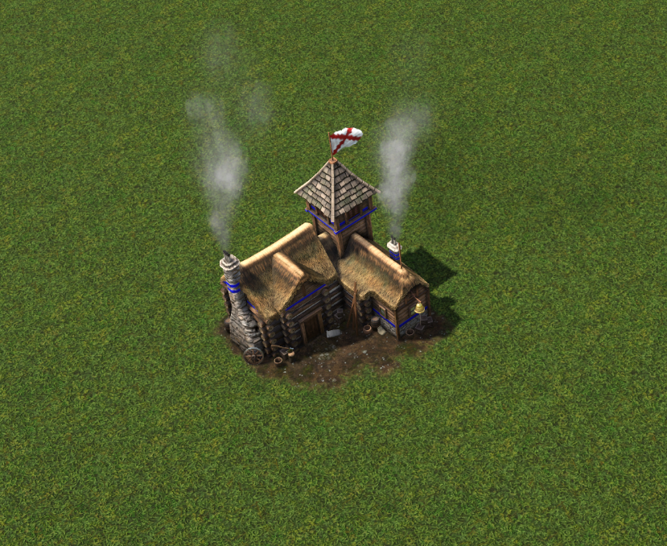

**Visual Characteristics:**
- **Large multi-building complex** with central tower
- **Flag on top** showing player color (red flag in example)
- **Wooden/stone construction** with thatched roofs
- **Smoke from chimneys** (active building indicator)
- **Blue player-colored trim** on building edges
- **Surrounding dirt/foundation** area around building
- **Largest building** at player spawn location

**What to Look For:**
- Large central building at player start position
- Player-colored flag and building trim (blue, red, yellow, purple, green, orange, cyan, pink)
- Usually surrounded by starting units (villagers, explorer, wagons)
- Located in player spawn areas
- Active smoke effects from chimneys

**Debugging Use:**
- Verify player spawn locations
- Check if all players spawned correctly
- Validate spawn spacing and constraints
- Confirm starting resources nearby
- Identify player color by flag and building trim

**Common Issues:**
- Town center too close to water/cliffs
- Overlapping with other objects
- Missing starting units
- Incorrect player color on flag/trim
- Town center not fully visible (partially spawned)

---

### **2. 🚩 WATER FLAGS**

**Types:**

**A. Player Water Spawn Flags**

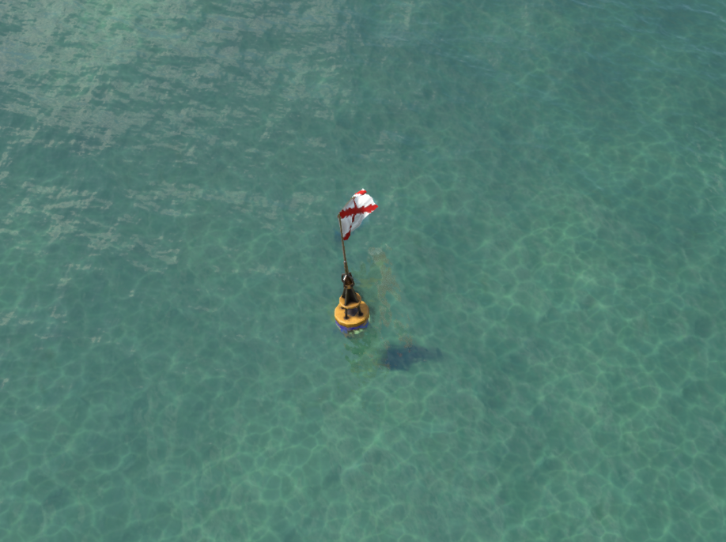

**General Visual Characteristics:**
- **Identical structure to native flags** - Same flagpole and buoy
- **Flag pole in water** with small circular base/buoy
- **Civilization-specific flag pattern** (varies by player's civilization)
- **Flag waves/animates** in the wind
- **Located in navigable water** near player spawn
- **Small yellow/gold buoy** at base of flagpole
- **Visible from distance** - clear naval spawn point marker

---

#### **Player Civilization Flag Pattern Guide:**

**Player 1 (Blue) - Spanish**

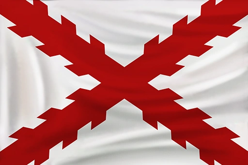

- **Pattern:** Burgundian Cross (Cross of Burgundy)
- **Colors:** Red jagged cross on white background
- **Design:** Diagonal red cross with jagged/branching edges
- **Recognition:** Distinctive X-shaped cross with irregular edges

---

**Player 2 (Red) - British**

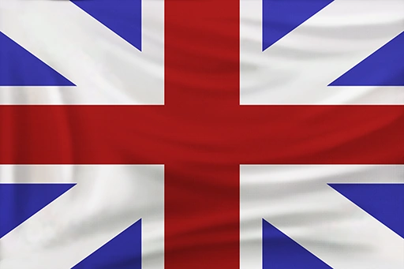

- **Pattern:** Union Jack
- **Colors:** Red, white, and blue
- **Design:** Overlapping crosses - red cross of St. George, white-bordered red diagonal cross of St. Patrick, white diagonal cross of St. Andrew on blue
- **Recognition:** Iconic British flag with multiple overlapping crosses

---

**Player 3 (Yellow) - French**

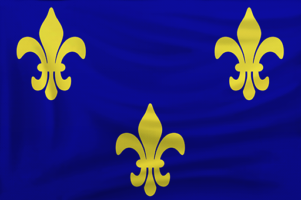

- **Pattern:** Three Fleur-de-lis
- **Colors:** Gold/yellow fleur-de-lis on blue background
- **Design:** Three golden fleur-de-lis arranged in triangle pattern (2 top, 1 bottom)
- **Recognition:** Royal French heraldic symbol, distinctive lily/iris flower shape

---

**Player 4 (Purple) - Portuguese**


- **Pattern:** Royal coat of arms with crown
- **Colors:** Gold crown, red shield with white center, blue shields
- **Design:** 
  - Top: Ornate gold crown
  - Center: Red shield with white cross containing five blue shields (quinas)
  - Border: Gold castles on red background
- **Recognition:** Complex heraldic design with crown and multiple shields

---

**Player 5 (Green) - Dutch**

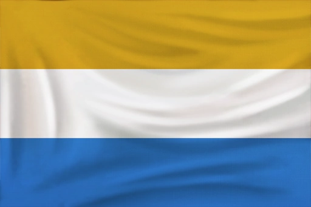

- **Pattern:** Horizontal tricolor
- **Colors:** Orange (top), white (middle), blue (bottom)
- **Design:** Three equal horizontal stripes
- **Recognition:** Simple tricolor, orange-white-blue pattern

---

**Player 6 (Orange) - Russian**

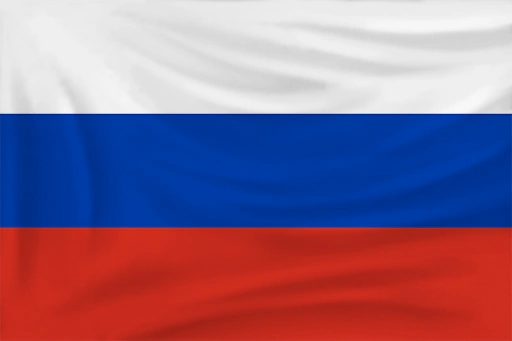

- **Pattern:** Horizontal tricolor
- **Colors:** White (top), blue (middle), red (bottom)
- **Design:** Three equal horizontal stripes
- **Recognition:** Simple tricolor, white-blue-red pattern

---

**Player 7 (Cyan) - German**

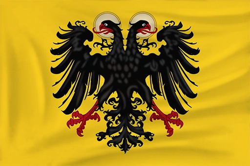

- **Pattern:** Double-headed eagle (Holy Roman Empire)
- **Colors:** Black eagle with gold/yellow details on gold background
- **Design:** Heraldic double-headed eagle with spread wings, holding scepter and orb, with smaller shields on chest
- **Recognition:** Distinctive two-headed eagle, very detailed heraldic design

---

**Player 8 (Pink) - Ottoman**

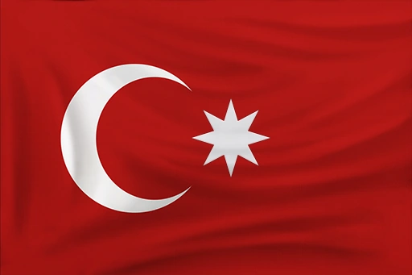

- **Pattern:** Crescent and star
- **Colors:** White crescent and star on red background
- **Design:** Crescent moon with eight-pointed star
- **Recognition:** Classic Ottoman/Turkish symbol, simple but distinctive

---

**Location:** 
- In water near player spawn areas
- Close to shore for accessibility
- Strategic naval unit spawn points

**Purpose:** 
- Player naval unit spawn points
- Home City shipment arrival location (water)
- Naval unit production spawn

**Debugging:** 
- Check water accessibility and depth
- Verify proper distance from shore (not too far, not on land)
- **Validate player civilization matches flag pattern:**
  - Player 1 (Blue) = Spanish (Burgundian cross)
  - Player 2 (Red) = British (Union Jack)
  - Player 3 (Yellow) = French (Fleur-de-lis)
  - Player 4 (Purple) = Portuguese (Royal coat of arms)
  - Player 5 (Green) = Dutch (Orange-white-blue)
  - Player 6 (Orange) = Russian (White-blue-red)
  - Player 7 (Cyan) = German (Double-headed eagle)
  - Player 8 (Pink) = Ottoman (Crescent and star)
- Confirm flag renders correctly with proper texture

**Common Issues:**
- Flags on land (water constraint failed)
- Flags too far from shore (inaccessible)
- Flags overlapping with other objects
- Missing flags for naval maps
- Wrong civilization flag for player slot
- Flag not visible (rendering issue)
- Flag texture not loading (shows default)
- Flag in too-shallow water

---

**B. Native Water Spawn Flags**

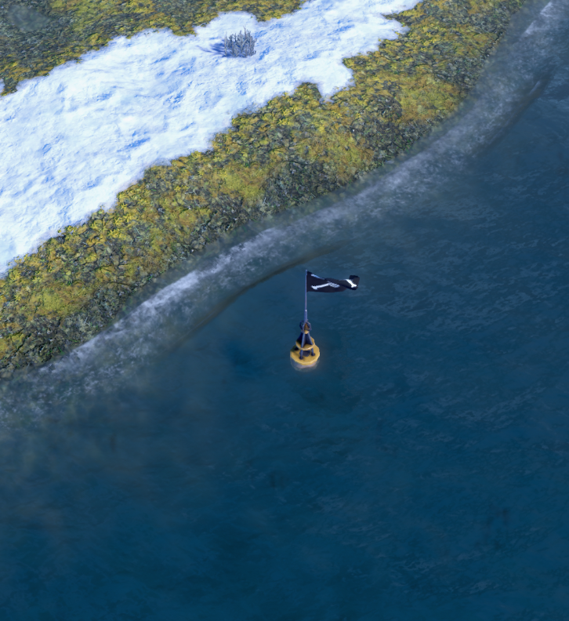

**General Visual Characteristics:**
- **Flag pole in water** with small circular base/buoy
- **Faction-specific flag pattern** (varies by native type)
- **Flag waves/animates** in the wind
- **Located in navigable water** near coastline
- **Small yellow/gold buoy** at base of flagpole
- **Visible from distance** - clear spawn point marker

---

#### **Native Flag Pattern Guide:**

**1. Pirates (Jolly Roger)**


- **Pattern:** Skull and crossbones (classic Jolly Roger)
- **Colors:** White skull on black background
- **Design:** Central skull with two crossed bones beneath
- **Native Type:** Pirate settlements and havens
- **Recognition:** Most iconic pirate symbol

---

**2. Wokou Pirates**


- **Pattern:** Three crossed golden symbols in circular emblem
- **Colors:** Gold/yellow symbols on red circle, black background
- **Design:** Central cross with two crossed anchors or tools below, gold ring border
- **Native Type:** Asian/Japanese pirate faction (Wokou)
- **Recognition:** Circular emblem with triple-cross pattern

---

**3. Hansakontor (Hanseatic League)**

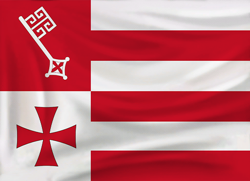

- **Pattern:** Red and white horizontal stripes with symbols
- **Colors:** Red and white alternating bands
- **Design:** 
  - Top left: White key symbol on red background
  - Bottom left: Red Maltese/Templar cross on white background
  - Right side: Three horizontal red and white stripes
- **Native Type:** Hanseatic trading posts and merchant settlements
- **Recognition:** Distinctive striped pattern with key and cross symbols

---

**4. Venetian Republic**

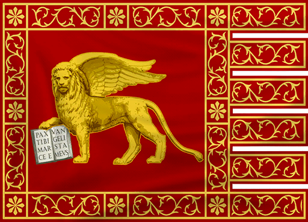

- **Pattern:** Winged Lion of St. Mark with ornate border
- **Colors:** Gold lion on red background with gold decorative border
- **Design:** 
  - Central: Golden winged lion holding an open book (reading "PAX TIBI MARCE EVANGELISTA MEUS")
  - Border: Elaborate gold floral/vine pattern with star motifs
  - Right side: Horizontal decorative bands
- **Native Type:** Venetian trading posts and maritime settlements
- **Recognition:** Iconic winged lion symbol, ornate golden border, very detailed design

---

**5. Scientists/Inventors (Secret Society)**


- **Pattern:** Skull with octopus tentacles in circular emblem
- **Colors:** Orange/copper on black background
- **Design:** 
  - Central: Skull with six octopus tentacles spreading outward
  - Border: Double circular ring in orange/copper
  - Style: Secret society/mysterious organization aesthetic
- **Native Type:** Inventor sites, scientific settlements, secret societies
- **Recognition:** Unique skull-octopus hybrid symbol (Hydra-like), orange color scheme

---

**Location:** 
- Near native water settlements or trade routes
- In water, close to shore
- Strategic naval spawn points

**Purpose:** 
- Native naval spawn points
- Faction-specific ship spawn locations
- Naval unit production points

**Debugging:** 
- Verify native placement and water access
- Check flag is in water (not on land)
- Confirm proper distance from shore
- **Validate native type matches flag pattern:**
  - Pirates = Jolly Roger (skull and crossbones)
  - Wokou = Gold triple-cross in red circle
  - Hansakontor = Red/white stripes with key and cross
  - Venetian = Golden winged lion with ornate border
  - Scientists/Inventors = Orange skull with octopus tentacles
- Verify flag design renders correctly

**Common Issues:**
- Flags on land (water constraint failed)
- Flags too far from shore
- Flags overlapping with trade routes
- Missing flags for water maps
- Wrong flag pattern for native type
- Flag not visible (rendering issue)
- Flag texture not loading (shows default)

---

### **3. 🎮 CONTROLLERS**

**Controller on Land:**

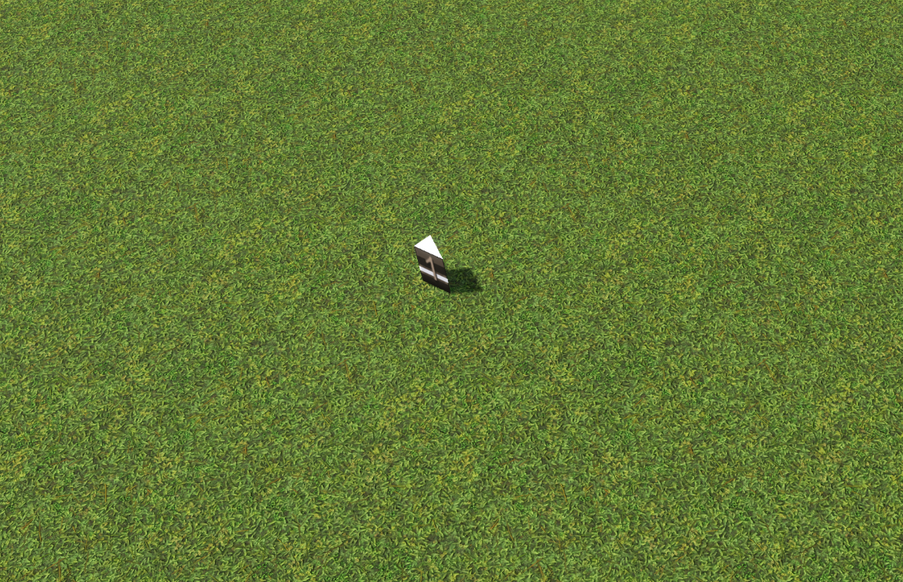

**Controller in Water (Usually indicates Incorrect Placement):**

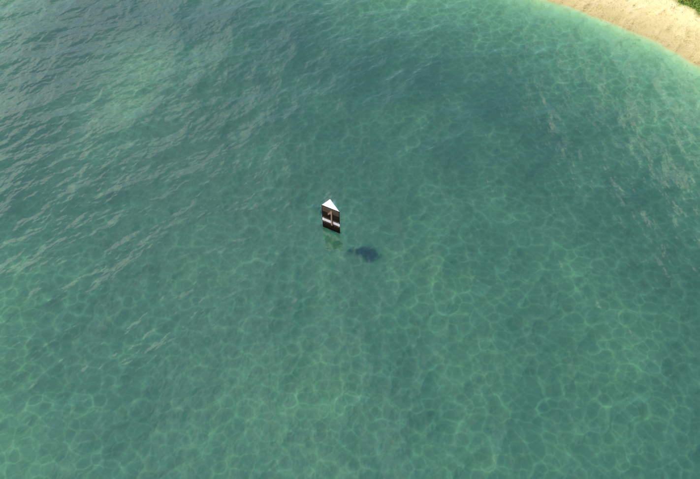

**What They Are:**
- Small objects that control map features and mechanics
- Trigger points for map events
- Reference points for grouping placement
- Usually invisible or minimal visual presence in-game

**Visual Characteristics:**
- **Small black and white clapperboard/slate** object
- **Film director's clapperboard appearance** - black base with white striped top
- **Very small size** - easy to miss on the map
- **Minimal footprint** - doesn't obstruct gameplay
- **May be invisible** in normal gameplay (visible in editor/scenario mode)
- **Black shadow** underneath the object
- **Can appear on land OR water** (though water placement is usually incorrect)

**Types:**
- **Water spawn controllers** - Control naval spawns
- **Trade route controllers** - Manage trade route behavior
- **KOTH controllers** - King of the Hill mechanics
- **City state controllers** - Capturable building mechanics
- **Grouping reference controllers** - Anchor points for complex groupings
- **Trigger controllers** - Activate map events and mechanics

**Debugging Use:**
- Verify controller placement at correct coordinates
- Check if triggers are working properly
- Validate reference points for groupings
- Confirm mechanic activation (KOTH, trade routes, etc.)
- Ensure controllers aren't accidentally deleted or moved
- Verify controller unit type matches intended function

**Visual Identification Tips:**
- Look for small clapperboard objects on the map
- Often placed at strategic locations (center, trade route points, spawn areas)
- Check editor mode if not visible in-game
- May appear as small markers or flags depending on type
- Look for trigger indicators in scenario editor

**Common Issues:**
- **Controller placed in water instead of land** (see water example above) - Most controllers should be on land
- Controller placed at wrong coordinates
- Controller deleted accidentally
- Wrong controller type used
- Multiple controllers overlapping
- Controller not triggering mechanics
- Controller visible in-game (should be invisible)
- Controller blocking unit movement
- Controller too far from intended reference point

---

### **4. 🔌 TRADE ROUTE SOCKETS**

#### **A. Trade Route Sockets (Buildable)**

**What They Are:**
- Empty socket sites where players can build trade posts
- Placed at intervals along trade routes
- Players construct their own trading posts here

---

### **🔍 Common Identifying Patterns (All Socket Types)**

**Universal Visual Characteristics:**

1. **Small cleared area** - Circular or rectangular cleared ground space
2. **Light-colored structures** - White, cream, or tan canvas/fabric elements
3. **Minimal footprint** - Small building or tent structure (not large buildings)
4. **Market/trading decorations** - Goods, barrels, items on ground
5. **Vertical elements** - Poles, posts, or tent supports
6. **Located along trade route** - Always near white trade route lines on minimap
7. **Isolated placement** - Single structure, not part of larger settlement
8. **Ground clearing** - Dirt/cleared patch around the structure
9. **Simple construction** - Basic tent/hut/stall design (not elaborate buildings)

**Key Recognition Features:**
- ✅ **White or light-colored canvas/fabric** - Most common element across all types
- ✅ **Small scale** - Significantly smaller than town centers or native settlements
- ✅ **Trade route alignment** - Always positioned along the trade route path
- ✅ **Single structure focus** - One main building/tent, minimal surrounding objects
- ✅ **Market aesthetic** - Trading post appearance, not military or residential
- ⚠️ **Socket rotation follows trade route** - Appearance varies depending on viewing angle; sockets rotate to align with trade route direction

**What to Look For When Identifying:**
1. Look for **light-colored structures** (white/cream tents or canvas)
2. Check if it's **along a trade route line** (white line on minimap)
3. Verify it's a **small, isolated structure** (not a large settlement)
4. Confirm **market/trading decorations** are present
5. Ensure it's **not a player building** (no player colors)

---

### **Regional Socket Type Examples:**

While sockets vary by region, they all share the common patterns above. Here are the 4 regional variations:

**African Style:**

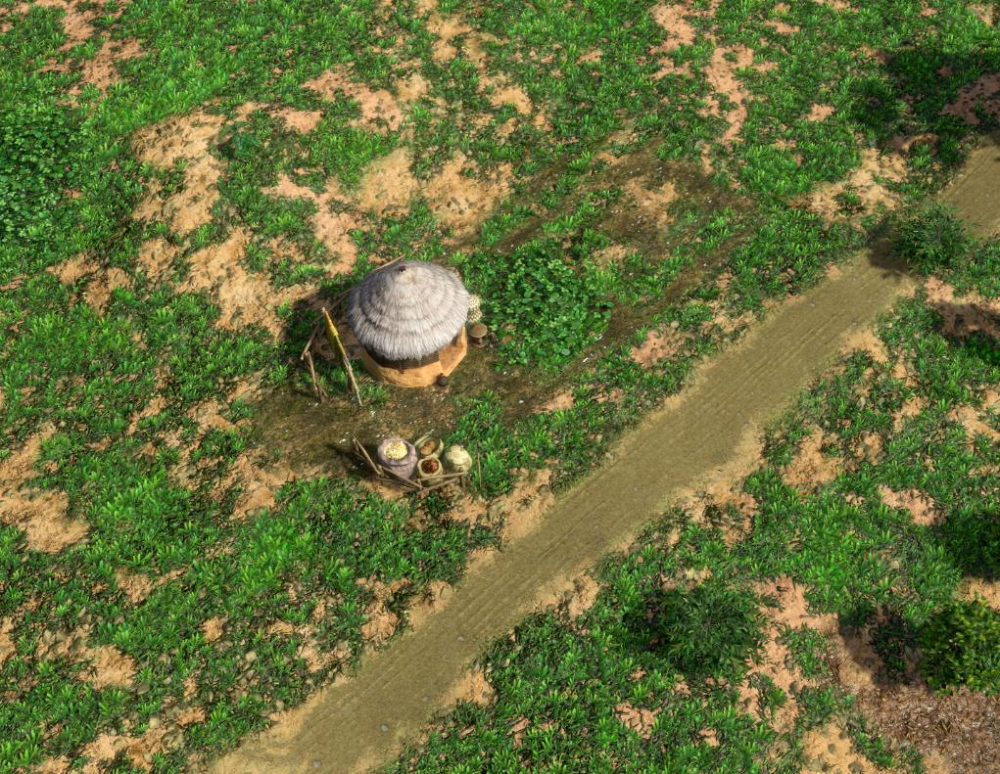

- **Appearance:** Thatched hut with circular roof
- **Color:** Brown/tan with grey thatched roof
- **Decorations:** Small market items, pottery, goods on ground
- **Style:** Traditional African village market
- **Recognition:** Round hut structure with conical thatched roof

---

**American Style:**

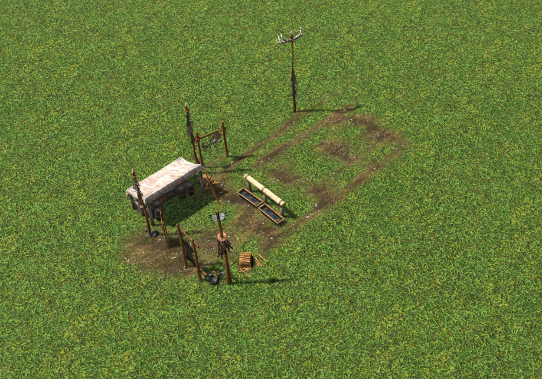

- **Appearance:** Native American trading post with tent/canopy
- **Color:** White/cream canvas tent with wooden poles
- **Decorations:** Totem pole, wooden racks, native items
- **Style:** Native American trading camp
- **Recognition:** White tent structure with tall totem pole

---

**European Style:**

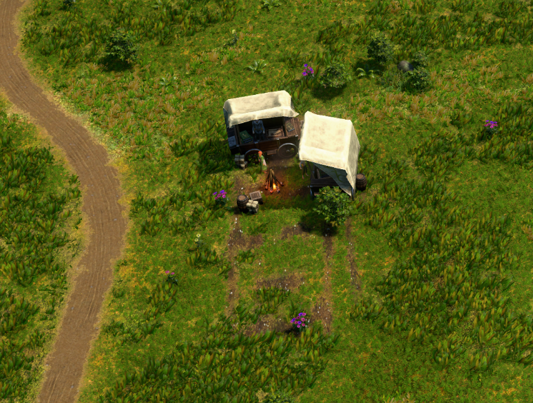

- **Appearance:** European market stalls with canvas covers
- **Color:** White/cream canvas awnings over wooden stalls
- **Decorations:** Campfire, market goods, barrels
- **Style:** European merchant camp
- **Recognition:** Two white canvas-covered market stalls

---

**Asian Style:**

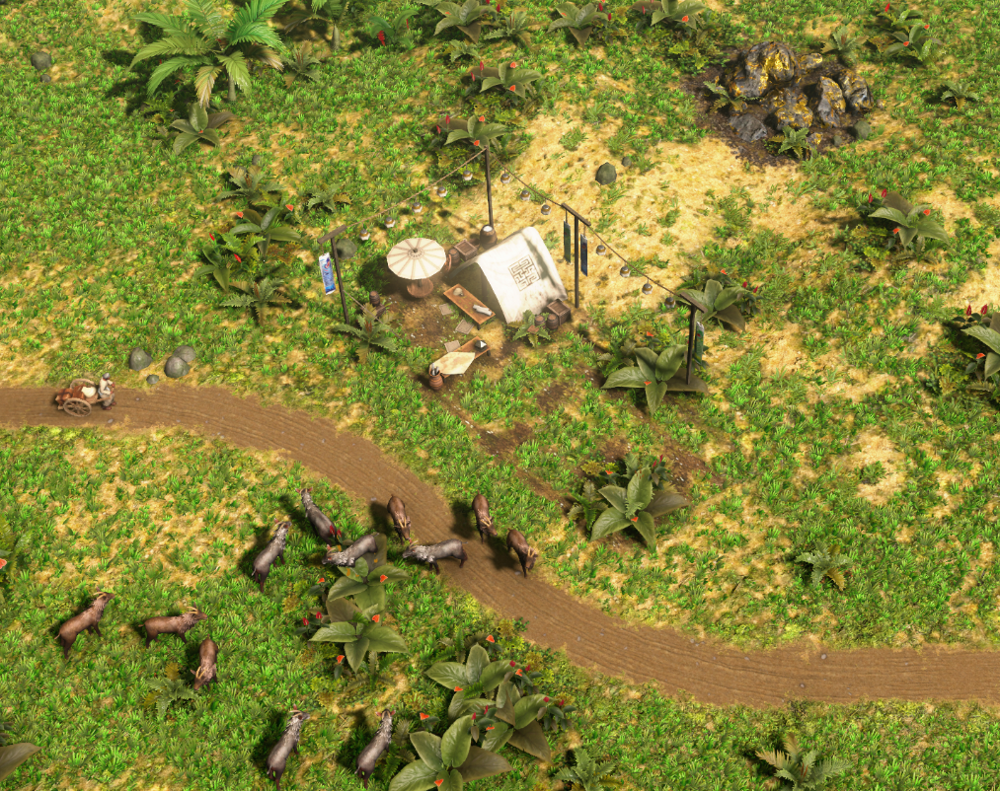

- **Appearance:** Asian-style tent with decorative elements
- **Color:** White tent with Asian architectural details
- **Decorations:** Asian lanterns, flags, market items, tropical plants
- **Style:** Asian trading post
- **Recognition:** White tent with Asian design elements and lanterns

---

### **🎯 Socket Detection Summary**

**To identify ANY buildable trade route socket, look for:**

1. ✅ **Light-colored structure** (white/cream/tan)
2. ✅ **Small size** (much smaller than buildings)
3. ✅ **Along trade route** (near white line on minimap)
4. ✅ **Isolated** (single structure, not part of settlement)
5. ✅ **Market aesthetic** (trading goods visible)

**Regional differences are SECONDARY** - Focus on these 5 core patterns first!

⚠️ **Important:** Socket structures **rotate to align with the trade route direction**. The same socket viewed from different angles (north, south, east, west) will appear differently. Focus on the core patterns above rather than exact visual appearance.

---

**Location:** 
- Along trade route paths (white lines on minimap)
- Evenly spaced intervals
- Strategic control points

**Purpose:** 
- Players build trade posts to generate income
- Control trade route for economic advantage
- Strategic positioning for map control

**Debugging Use:**
- **Primary:** Verify socket exists along trade route (use 5 core patterns above)
- Verify socket spacing along route (not too close)
- Check socket placement constraints (terrain, objects)
- Validate trade route path alignment
- Ensure sockets are accessible (not blocked)
- Regional style is less critical than presence/placement

**Common Issues:**
- **Missing sockets** - No socket structure visible along trade route
- Sockets too close together (spacing violation)
- Sockets off the trade route line
- Sockets overlapping with terrain/objects
- Sockets in inaccessible locations
- Wrong regional style for map (minor issue)

---

#### **B. Trade Route Sockets (Capturable)**

**What They Are:**
- Pre-built trading posts that players capture
- Already constructed buildings on trade routes
- Control points that change ownership when captured
- **Two main types:** Land sockets and Naval sockets

---

##### **B1. Capturable Land Sockets**

**General Characteristics:**
- **Fully constructed trading post buildings** (not empty sites)
- **Brown/neutral colored structures** (no player colors until captured)
- **Larger and more elaborate than buildable sockets**
- **Smoke from chimneys** indicating active buildings
- **Surrounded by decorative elements** (barrels, crates, market goods)
- **Located along land trade routes** (white lines on minimap)

---

**Regional Variations:**

**Asian Style Land Socket:**

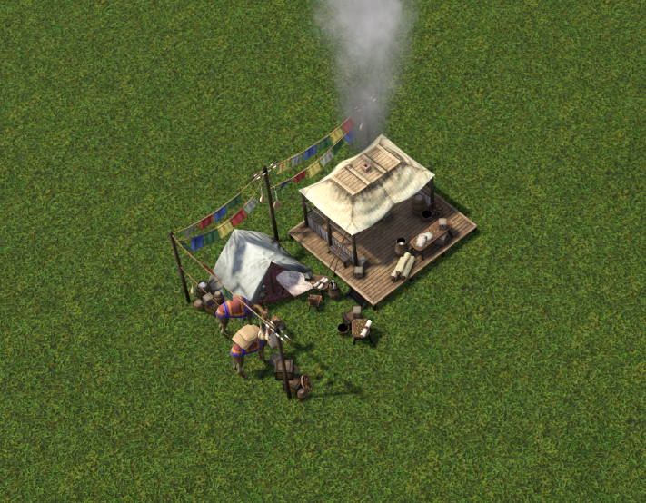

**Visual Characteristics:**
- **Two-story wooden building** with Asian architectural style
- **Cream/tan colored walls** with dark wooden trim
- **Multi-tiered roof** with Asian design elements
- **Smoke rising from chimney** (active building indicator)
- **Market stall with white tent** adjacent to main building
- **Decorative prayer flags** on poles (colorful flags on strings)
- **Market goods and barrels** scattered around the area
- **Small cleared dirt area** around the structures
- **Wooden platform/deck** connecting structures

**Key Recognition Features:**
- ✅ Asian architectural style (tiered roof, wooden construction)
- ✅ White tent market stall with prayer flags
- ✅ Active smoke from chimney
- ✅ Two-structure complex (main building + market stall)
- ✅ Larger than buildable sockets

---

**European Style Land Socket:**

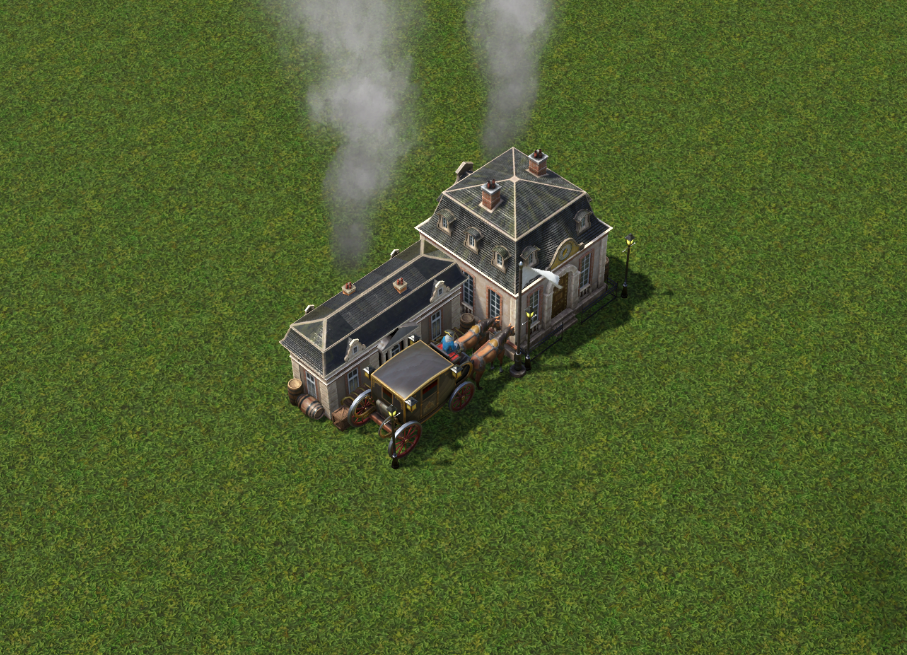

**Visual Characteristics:**
- **Large two-story European building** with colonial architecture
- **Grey/dark grey slate roof** with multiple sections
- **Cream/beige walls** with white trim and details
- **Central tower/cupola** on the roof
- **Multiple chimneys with smoke** (2+ smoke columns)
- **Wooden crates and barrels** at the base
- **Flags on roof peaks** (decorative elements)
- **Stone or wooden foundation** visible at base
- **Symmetrical design** with central entrance
- **Much larger footprint** than buildable sockets

**Key Recognition Features:**
- ✅ European colonial architecture (symmetrical, formal design)
- ✅ Multiple smoke columns from chimneys
- ✅ Central tower/cupola structure
- ✅ Grey slate roof with white trim
- ✅ Significantly larger than Asian style
- ✅ More elaborate and "official" appearance

---

**Train Station Style Land Socket:**

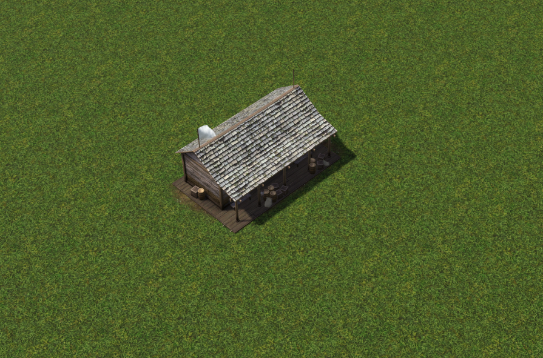

**Visual Characteristics:**
- **Single-story rectangular building** with simple design
- **Grey/white striped roof** (corrugated or tiled pattern)
- **Dark brown/wooden walls**
- **Platform or deck** extending from the building
- **Railway track visible** (indicates train route placement)
- **Smaller and simpler** than other capturable styles
- **Industrial/utilitarian appearance** (not decorative)
- **Minimal decorations** (functional design)
- **Chimney with smoke** (may be present)

**Key Recognition Features:**
- ✅ Simple rectangular building design
- ✅ Striped/corrugated roof pattern
- ✅ Railway tracks visible nearby
- ✅ Industrial/functional aesthetic
- ✅ Smaller than Asian/European styles
- ✅ Platform or loading area

---

**Common Features Across All Land Capturable Sockets:**

1. ✅ **Fully constructed buildings** (not tents or empty sites)
2. ✅ **Active smoke from chimneys** (building is "alive")
3. ✅ **Neutral brown/tan colors** (no player colors until captured)
4. ✅ **Larger than buildable sockets** (substantial structures)
5. ✅ **Decorative elements** (barrels, crates, market goods)
6. ✅ **Located on land trade routes** (white lines on minimap)
7. ✅ **Cleared ground area** around the structure
8. ✅ **Capturable by any player** (control point objective)

---

**Location:** 
- Along land trade route paths (white lines on minimap)
- Strategic control points
- Often at key intersections or map features
- May be part of larger groupings (city blocks, settlements)

**Purpose:** 
- Capture to gain trade route income
- Control trade route without building
- Strategic objectives for early game control
- Higher income than buildable sockets

**Debugging Use:**
- Verify capturable socket placement on land (not water)
- Check ownership mechanics and capture radius
- Confirm socket type matches map design intent
- Validate trade route path alignment
- Ensure proper socket style for map region
- Verify smoke effects are active
- Check for complete structure spawn (all buildings present)

**Common Issues:**
- Capturable sockets placed instead of buildable (or vice versa)
- Sockets too close to player spawns (unfair advantage)
- Sockets overlapping with other objects or terrain
- Wrong socket style for map region (minor issue)
- Capture radius too small/large
- Sockets not aligned with trade route path
- Missing smoke effects (building appears inactive)
- Partial spawn (some decorative elements missing)
- Socket on wrong terrain type (water, cliffs, etc.)

---

##### **B2. Capturable Naval Sockets**

**What They Are:**
- Pre-built coastal trading posts for water trade routes
- **Located on land near water** (not floating structures)
- Capturable by land units (not ships directly)
- Control points for water-based trade routes
- Require coastal placement (land adjacent to navigable water)

**General Characteristics:**
- **Coastal structures on land** (at water's edge)
- **Tall tower or lighthouse design** (visible from distance)
- **Multi-story buildings** with distinctive architecture
- **Neutral brown/tan colors** (no player colors until captured)
- **Located at shoreline** (land meets water transition)
- **Along water trade routes** (dotted white lines on minimap)
- **Larger and more prominent than land sockets**

---

**Regional Variations:**

**Oriental Style Naval Socket:**

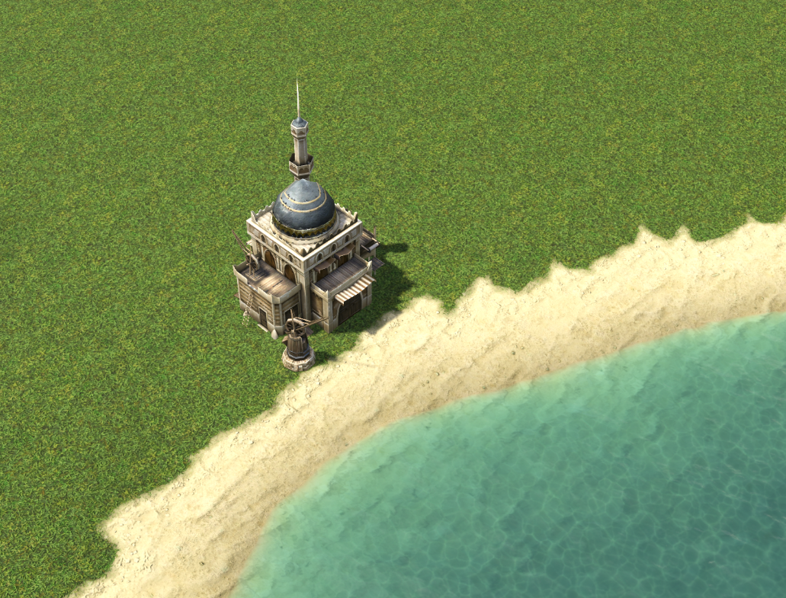

**Visual Characteristics:**
- **Three-story tower structure** with Asian pagoda-style architecture
- **Large blue/grey dome** at the top with ornate details
- **Tall spire/finial** extending from dome peak (lighthouse-like)
- **Cream/tan colored walls** with dark wooden trim
- **Multi-tiered design** with balconies/platforms on each level
- **Square base** with decorative columns
- **Wooden dock/platform** extending toward water
- **Positioned on grass** at the edge of sandy beach
- **Very tall and prominent** - easily visible landmark
- **No smoke** (lighthouse/tower design, not residential)

**Key Recognition Features:**
- ✅ Asian pagoda/temple tower architecture
- ✅ Large blue dome with tall spire
- ✅ Three distinct levels/tiers
- ✅ Coastal placement (grass → beach → water)
- ✅ Tallest naval socket type
- ✅ Lighthouse/beacon appearance
- ✅ Ornate decorative elements

---

**Standard Style Naval Socket:**

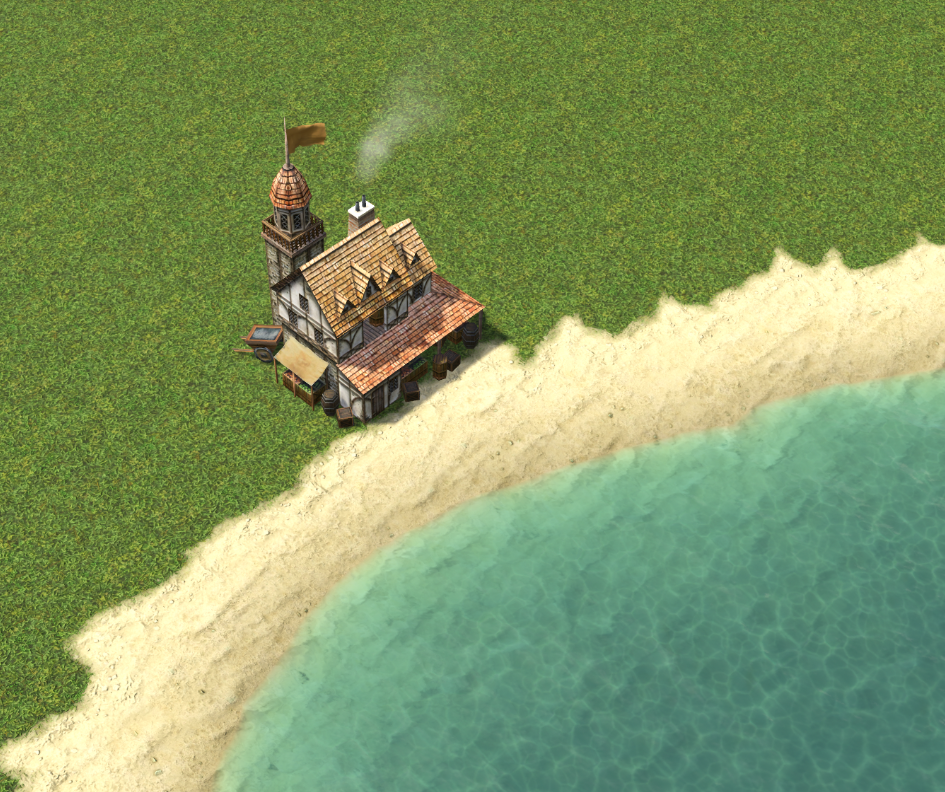

**Visual Characteristics:**
- **Two-story building** with European colonial architecture
- **Tall tower/lighthouse** on one side with flag on top
- **Orange/brown tiled roof** (multiple roof sections)
- **Cream/tan colored walls** with dark wooden trim
- **Smoke rising from chimney** (active building indicator)
- **Flag on tower peak** (brown/neutral colored)
- **Wooden dock/pier** extending toward water
- **Small boat visible** near the structure
- **Positioned on grass** at the edge of sandy beach
- **Compact footprint** compared to Oriental style
- **Mixed residential/lighthouse design**

**Key Recognition Features:**
- ✅ European colonial architecture with tower
- ✅ Orange tiled roof sections
- ✅ Active smoke from chimney
- ✅ Flag on tower (neutral brown)
- ✅ Coastal placement (grass → beach → water)
- ✅ Smaller than Oriental style
- ✅ Residential + lighthouse hybrid design
- ✅ Visible boat/dock elements

---

**Common Features Across All Naval Capturable Sockets:**

1. ✅ **Coastal land placement** (NOT in water - on land at water's edge)
2. ✅ **Tall tower/lighthouse element** (vertical prominence)
3. ✅ **Multi-story construction** (2-3 levels)
4. ✅ **Neutral brown/tan colors** (no player colors until captured)
5. ✅ **Beach/shoreline transition** (grass → sand → water)
6. ✅ **Wooden dock/platform** extending toward water
7. ✅ **Larger than land sockets** (more prominent structures)
8. ✅ **Located along water trade routes** (dotted white lines on minimap)
9. ✅ **Capturable by land units** (not ships)

---

**Location:** 
- **On land at the shoreline** (NOT in water)
- At the transition between grass and beach/water
- Along water trade route paths (dotted white lines on minimap)
- Strategic coastal control points
- Adjacent to navigable water

**Purpose:** 
- Capture to gain water trade route income
- Control water trade routes from coastal positions
- Strategic objectives for naval map control
- Higher income than buildable sockets
- Lighthouse/beacon functionality (visual landmark)

**Debugging Use:**
- Verify socket placement on land (not in water!)
- Check coastal placement (land adjacent to water)
- Confirm proper beach/shoreline transition
- Validate water trade route alignment
- Ensure socket accessible by land units
- Verify tower/lighthouse visibility
- Check for complete structure spawn
- Confirm smoke effects (if applicable to style)

**Common Issues:**
- **Socket placed in water** (should be on land at shore)
- Socket too far from water (not coastal)
- Beach/shoreline transition missing or incorrect
- Sockets overlapping with cliffs or terrain
- Wrong socket style for map region (minor issue)
- Capture radius too small/large
- Sockets not aligned with water trade route path
- Missing smoke effects (Standard style only)
- Partial spawn (tower or dock missing)
- Socket on wrong terrain type (not coastal)
- Water not navigable near socket
- Socket too close to player spawns (unfair advantage)

---

### **5. 🏗️ NATIVE SETTLEMENT GROUPINGS**

#### **What Are Groupings:**
Pre-built collections of buildings, units, and decorations placed as a single unit on random maps. Native settlement groupings are the most common type and contain:
- **Socket site** - Empty space where players build a trading post to ally with natives
- **Native buildings** - Tribal structures (huts, longhouses, etc.)
- **Native units** - Villagers and warriors of the tribe
- **Decorative elements** - Fences, totems, campfires, vegetation
- **Path blockers** - Small controller-like objects that prevent building placement

**Purpose:**
- Provide native allies for players who build trading posts
- Add strategic control points to the map
- Offer unique units and technologies per tribe
- Create visual diversity and historical authenticity

---

#### **A. Native Settlement Groupings - General Structure**

**Example: Maori Settlement Grouping**

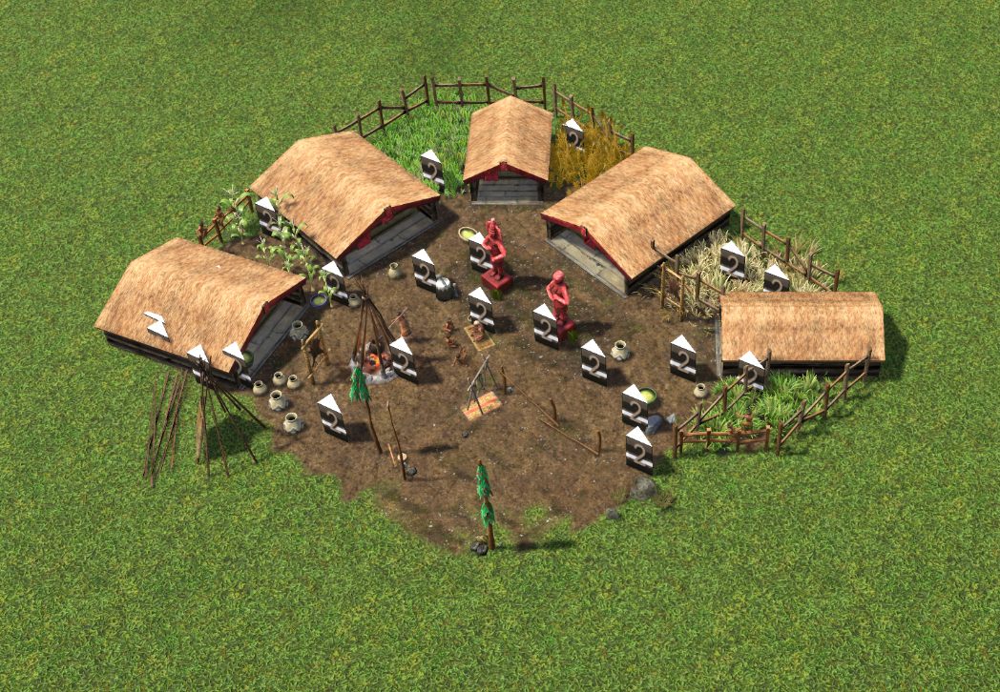

---

**Visual Characteristics:**

**1. Socket Site (Center):**
- **Large circular cleared dirt area** in the center
- **Empty space** where trading post will be built
- **Darker brown dirt** compared to surrounding grass
- **No structures in the center** - intentionally empty
- **Surrounded by native buildings** in a ring pattern

**2. Native Buildings:**
- **5-6 tribal huts** arranged in a circle around the socket
- **Tan/brown thatched roofs** (straw/reed material)
- **Dark wooden walls** or open-sided structures
- **Maori architectural style** - curved roofs, open designs
- **Red decorative trim** on some buildings
- **Smoke from some buildings** (active settlement indicator)
- **Buildings face inward** toward the central socket

**3. Native Units:**
- **Multiple native villagers** (white/tan clothing)
- **Native warriors** (red/colored clothing with weapons)
- **Units scattered throughout** the settlement
- **Some units near buildings**, others in open areas
- **Defensive positioning** around the perimeter

**4. Path Blockers:**
- **Small black and white clapperboard objects** (same as controllers)
- **Film slate appearance** - identical to controller units
- **Scattered around the perimeter** of the settlement
- **Prevent players from building** too close to natives
- **Create buffer zone** around the grouping
- **Multiple blockers** (10-20+ per settlement)
- **Form invisible boundary** for construction

**5. Decorative Elements:**
- **Wooden fences** at the perimeter (brown stick fences)
- **Vegetation** - small bushes, grass tufts
- **Campfires** or cooking areas
- **Storage items** - barrels, crates, pots
- **Totems or cultural markers** (tribe-specific)
- **Pathways** - dirt trails between buildings

---

**Key Recognition Features:**

1. ✅ **Circular cleared dirt area** in center (socket site)
2. ✅ **Ring of native buildings** surrounding the socket
3. ✅ **Native units present** (villagers and warriors)
4. ✅ **Path blockers visible** (black/white clapperboard objects)
5. ✅ **Perimeter fencing** or boundary markers
6. ✅ **Tribal architectural style** (varies by tribe)
7. ✅ **Active settlement** (smoke, units moving)
8. ✅ **Decorative cultural elements** (totems, campfires)

---

**Common Native Settlement Elements:**

**Socket Site Characteristics:**
- **Always in the center** of the grouping
- **Circular or oval shape** (cleared area)
- **Dirt terrain** (darker than grass)
- **Empty space** - no buildings or obstructions
- **Radius varies** by tribe and grouping size
- **Player builds trading post here** to ally with natives

**Path Blocker Characteristics:**
- **Identical appearance to controllers** (film clapperboard)
- **Small size** - easy to overlook
- **Black base with white striped top**
- **Scattered placement** around settlement edges
- **Prevent construction** in native territory
- **Not visible on minimap** (unlike buildings)
- **Cannot be deleted** by players
- **Part of the grouping** - spawn together

**Native Building Patterns:**
- **Circular arrangement** most common
- **Buildings face inward** toward socket
- **Consistent spacing** between structures
- **Tribal architectural style** (huts, longhouses, teepees)
- **Smoke effects** on some buildings
- **Decorative trim** in tribal colors

---

**Debugging Use:**

**Verify Complete Spawn:**
- [ ] Socket site present and clear (no obstructions)
- [ ] All native buildings spawned (count matches expected)
- [ ] Native units present (villagers and warriors)
- [ ] Path blockers visible around perimeter
- [ ] Decorative elements present (fences, totems, etc.)
- [ ] Smoke effects active (if applicable)

**Check Placement:**
- [ ] Grouping on appropriate terrain (flat land, coastal, etc.)
- [ ] No overlap with other objects (resources, cliffs, water)
- [ ] Socket site accessible (not blocked by terrain)
- [ ] Adequate spacing from player spawns
- [ ] Path blockers form proper boundary
- [ ] Buildings not clipping through terrain

**Validate Functionality:**
- [ ] Socket site allows trading post construction
- [ ] Native units are active (not stuck)
- [ ] Path blockers prevent construction as intended
- [ ] Grouping aligned properly (not rotated incorrectly)

---

**Common Issues:**

**Placement Problems:**
- Grouping spawned on wrong terrain (water, cliffs, steep slopes)
- Socket site obstructed by terrain or objects
- Buildings overlapping with each other
- Grouping too close to player spawns (unfair advantage)
- Grouping overlapping with trade routes or other groupings

**Partial Spawn:**
- Some buildings missing (incomplete grouping)
- Native units not spawned
- Path blockers missing (players can build too close)
- Decorative elements absent
- Smoke effects not active

**Rotation/Alignment:**
- Grouping rotated incorrectly (buildings facing wrong way)
- Socket site not centered properly
- Path blockers misaligned
- Fences or boundaries incomplete

**Terrain Mismatch:**
- Coastal grouping on inland location
- Inland grouping on coast
- Grouping on impassable terrain
- Buildings on different elevations (clipping issues)

---

#### **B. Advanced Native Groupings - Condensed Multi-Building Structures**

**What Are These:**
More complex native groupings featuring condensed, multi-building complexes rather than simple circular villages. These represent advanced civilizations, religious orders, military fortifications, or cultural centers.

**Key Difference from Simple Native Settlements:**
- **No central socket site** (or socket integrated into building complex)
- **Tightly clustered buildings** forming a compound
- **Larger central structure** (fortress, monastery, palace, temple)
- **More elaborate architecture** (stone, multi-story, formal design)
- **Still uses path blockers** (same white triangular units)

---

##### **Example 1: Hussite War Camp (Medieval/Military Architecture)**

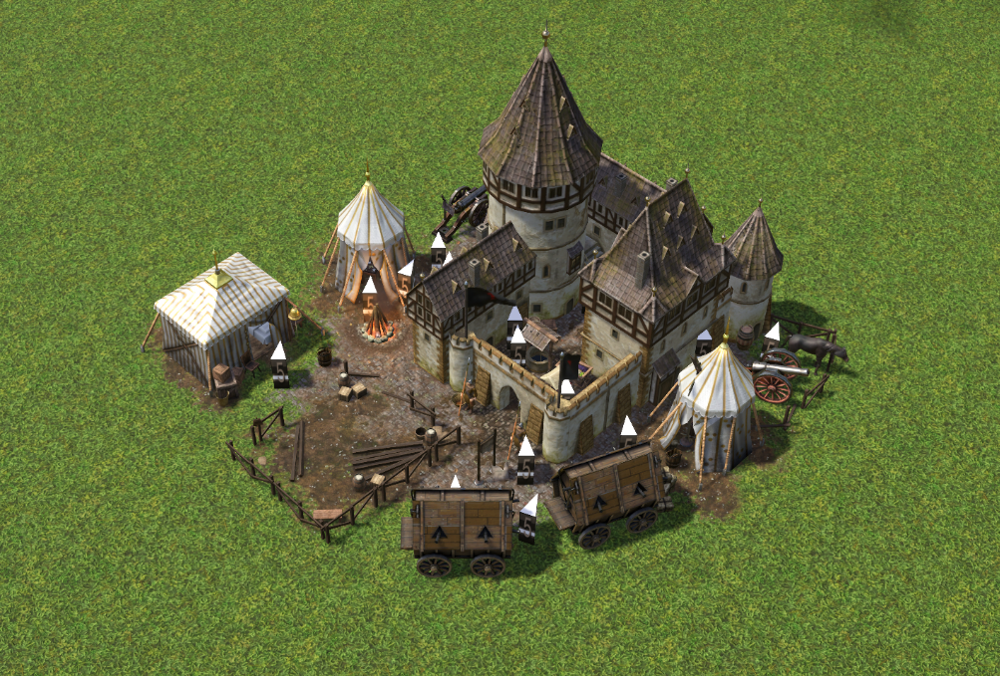

**Visual Characteristics:**

**1. Central Fortress:**
- **Large stone fortress** with multiple towers
- **Conical tiled roofs** (brown/grey striped pattern)
- **Stone walls** (cream/tan colored)
- **Multi-story construction** (2-3 levels)
- **Medieval Eastern European style**
- **Defensive architecture** with battlements

**2. Supporting Structures:**
- **4-6 military tents** (white/cream striped canvas)
- **Conical tent roofs** with wooden poles
- **War wagons** (wooden carts with wheels)
- **Small wooden buildings** (storage, barracks)
- **Campfires** and military equipment
- **Arranged around fortress** in defensive pattern

**3. Path Blockers:**
- **~20-25 white triangular units** scattered throughout
- **Same clapperboard appearance** as all native blockers
- **Densely placed** around entire perimeter
- **Create large buffer zone** around military camp

**4. Decorative Elements:**
- **Wooden fences** and barriers
- **Military props** (cannons, weapon racks, barrels)
- **Campfires** with smoke
- **Dirt pathways** between structures
- **Brown cleared ground** contrasting with grass

**Key Recognition Features:**
- ✅ **Stone fortress** as central focal point
- ✅ **Military tents** with striped canvas
- ✅ **War wagons** (distinctive wheeled carts)
- ✅ **Condensed layout** - buildings very close together
- ✅ **Path blockers** scattered throughout
- ✅ **Medieval/military aesthetic**

---

##### **Example 2: Jesuit Mission (Colonial/Religious Architecture)**

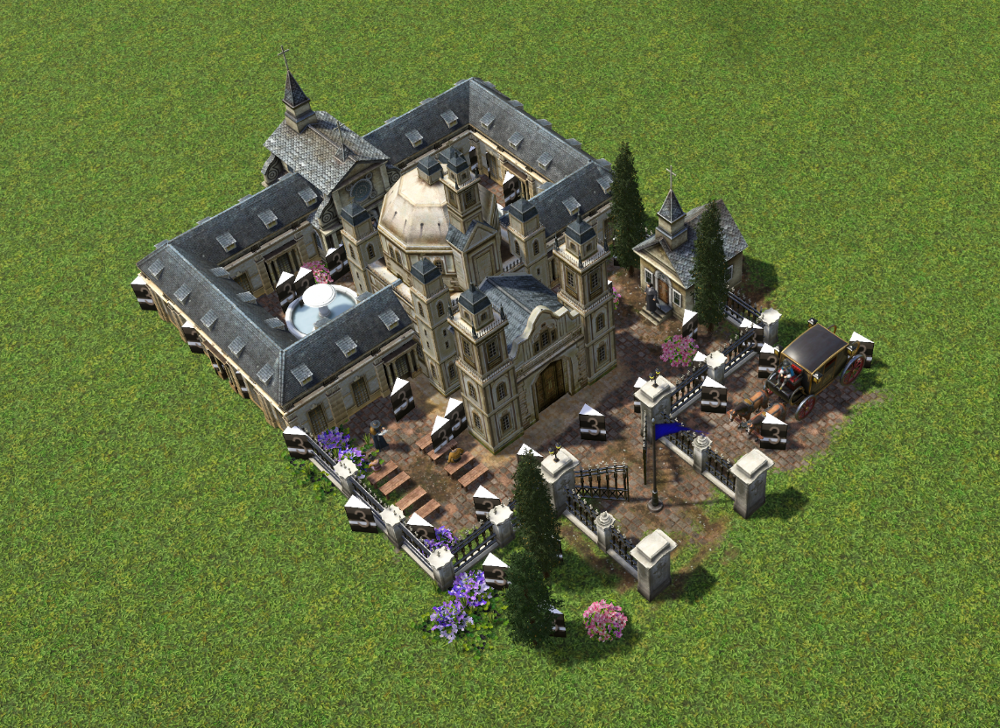

**Visual Characteristics:**

**1. Central Church/Monastery:**
- **Large baroque church** with ornate architecture
- **Grey slate roof** with multiple sections
- **Cream/tan stone walls** with decorative details
- **Central dome** (white/cream colored)
- **Bell towers** or spires
- **Formal European colonial style**
- **Symmetrical design**

**2. Courtyard Complex:**
- **Enclosed courtyard** with walls
- **Formal garden layout** (symmetrical paths)
- **Decorative vegetation** (purple flowers, pink bushes)
- **Cypress trees** or formal landscaping
- **Stone benches** and garden furniture
- **Black iron fencing** around perimeter

**3. Path Blockers:**
- **~15-20 white triangular units** scattered throughout
- **Same appearance** as all other native blockers
- **Placed around perimeter** and between garden elements
- **Create buffer zone** around religious complex

**4. Decorative Elements:**
- **Ornate black iron fencing** (decorative pattern)
- **Formal gardens** with flowers and trees
- **Stone pathways** and stairs
- **Garden benches** and statuary
- **Brown cleared ground** in courtyard areas
- **Purple and pink flowering plants**

**Key Recognition Features:**
- ✅ **Baroque church** as central structure
- ✅ **Formal courtyard** with symmetrical design
- ✅ **Decorative gardens** with flowers and trees
- ✅ **Black iron fencing** (ornate pattern)
- ✅ **Path blockers** scattered throughout
- ✅ **Religious/colonial aesthetic**

---

##### **Example 3: Sufi Mosque (Oriental/Islamic Architecture)**

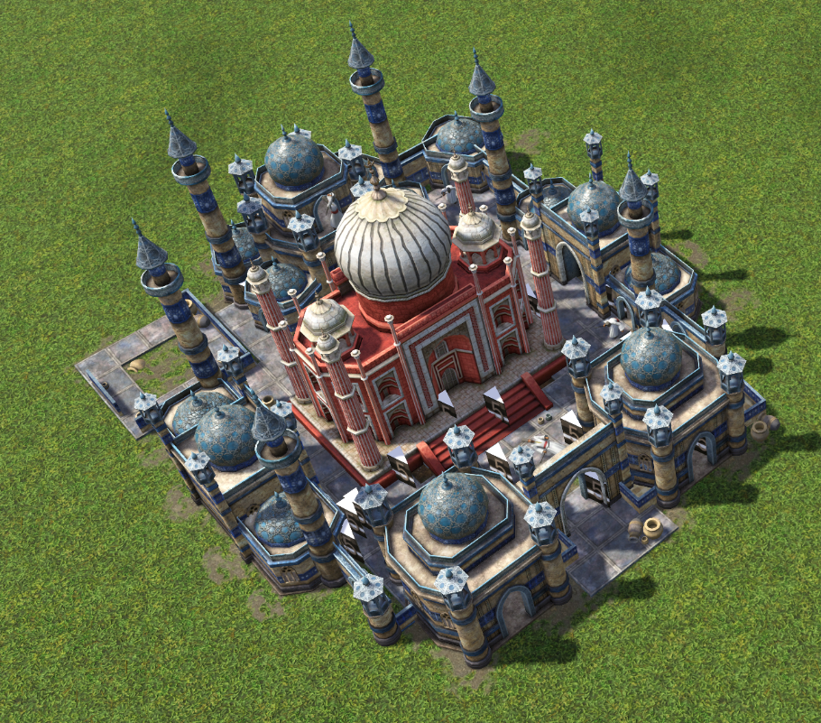

**Visual Characteristics:**

**1. Central Mosque:**
- **Large Islamic mosque** with ornate Oriental architecture
- **Red/burgundy main structure** with decorative details
- **Large cream/white ribbed dome** (central focal point)
- **Multiple smaller domes** (cream and blue-tiled)
- **Tall minarets** with blue conical tops (pointed spires)
- **Multi-story construction** (2-3 levels)
- **Symmetrical design** typical of Islamic architecture

**2. Courtyard Complex:**
- **Stone/tile courtyard platform** surrounding mosque
- **Four corner pavilions** with blue domes
- **Symmetrical layout** - perfect geometric arrangement
- **Multiple minarets** (8-10 towers) arranged around perimeter
- **Arched walkways** and corridors
- **Blue-tiled domes** contrasting with cream stone

**3. Path Blockers:**
- **~15-20 white triangular units** scattered throughout
- **Same clapperboard appearance** as all other native blockers
- **Placed around perimeter** and between architectural elements
- **Create buffer zone** around religious complex
- **Visible at corners and edges** of the courtyard

**4. Decorative Elements:**
- **Ornate Islamic architectural details** (arches, domes, minarets)
- **Blue ceramic tile domes** (distinctive Oriental style)
- **Stone courtyard** with geometric patterns
- **Multiple levels and platforms**
- **Brown cleared ground** at edges contrasting with grass
- **Symmetrical minaret placement**

**Key Recognition Features:**
- ✅ **Islamic mosque** as central structure
- ✅ **Multiple minarets** with blue conical tops
- ✅ **Large ribbed dome** (cream/white colored)
- ✅ **Symmetrical courtyard** with corner pavilions
- ✅ **Path blockers** scattered throughout
- ✅ **Oriental/Islamic aesthetic**
- ✅ **Blue-tiled domes** (distinctive feature)

---

#### **C. UNIVERSAL GROUPING IDENTIFICATION PATTERNS**

**⚠️ CRITICAL FOR AI AGENTS:** These patterns apply to **ALL grouping types** regardless of architectural style (medieval, industrial, oriental, indigenous, palace, religious, etc.)

---

##### **Pattern 1: Path Blockers (Native Block Units)**

**THE MOST RELIABLE IDENTIFIER - Present in 95%+ of all groupings**

**Visual Appearance:**
- **Small black and white clapperboard objects**
- **Film director's slate appearance**
- **Black base with white striped top**
- **Identical to controller units** (but different purpose)
- **Very small size** - approximately 1x1 meter footprint

**Placement Pattern:**
- **Scattered around perimeter** of grouping
- **15-30+ units per grouping** (varies by size)
- **Irregular spacing** - not in perfect grid
- **Form buffer zone** preventing construction
- **May also appear inside** grouping between buildings

**How to Identify:**
```
IF you see multiple (10+) small black/white clapperboard objects
   scattered around a cluster of buildings
THEN this is very likely a grouping
```

**⚠️ Path Blockers vs Controllers:**
- **Same visual appearance** - cannot distinguish by looks alone
- **Path blockers:** Multiple units (15-30+) around a settlement
- **Controllers:** Usually 1-3 units at specific strategic locations
- **Context matters:** Clustered around buildings = path blockers

---

##### **Pattern 2: Condensed Multi-Building Structure**

**Groupings have TIGHT clustering - buildings much closer than player-built structures**

**Characteristics:**
- **Multiple buildings** in small area (5-20+ structures)
- **Very close spacing** - buildings nearly touching
- **Central focal building** (largest/most prominent)
- **Supporting structures** arranged around it
- **Organic layout** - not perfect grid (unless urban grouping)

**Architectural Styles (All Valid):**
- **Indigenous:** Teepees, huts, longhouses, tribal structures
- **Medieval:** Stone castles, fortresses, war camps
- **Oriental:** Pagodas, temples, Asian architecture
- **Colonial:** Churches, monasteries, missions
- **Industrial:** Factories, warehouses, train stations
- **Palace:** Royal buildings, ornate structures
- **Military:** Forts, barracks, defensive structures

**Recognition Rule:**
```
IF buildings are clustered very tightly (closer than normal)
   AND there's a clear central focal building
   AND path blockers are present
THEN this is a grouping
```

---

##### **Pattern 3: Cleared Ground Area**

**Groupings create distinct terrain patches**

**Visual Characteristics:**
- **Brown dirt terrain** contrasting with green grass
- **Irregular organic shape** (not perfect circle/square)
- **Cleared area** larger than building footprints
- **May include pathways** between structures
- **Darker than surrounding terrain**

**Size Variations:**
- **Small groupings:** 10-20 meter diameter cleared area
- **Medium groupings:** 20-40 meter diameter
- **Large groupings:** 40-60+ meter diameter
- **Urban blocks:** May be rectangular (street-aligned)

---

##### **Pattern 4: Decorative Elements**

**Groupings include thematic props and decorations**

**Common Elements:**
- **Fencing/barriers** (wooden, iron, stone)
- **Vegetation** (trees, bushes, flowers)
- **Cultural items** (totems, statues, monuments)
- **Functional props** (carts, barrels, crates, benches)
- **Lighting** (campfires, lanterns, torches)
- **Smoke effects** from chimneys or fires

**Thematic Consistency:**
- **Indigenous:** Totems, campfires, wooden fences
- **Medieval:** War wagons, weapon racks, stone walls
- **Religious:** Gardens, statuary, ornate fencing
- **Industrial:** Machinery, crates, warehouses
- **Oriental:** Lanterns, decorative trees, Asian props

---

##### **Pattern 5: No Player Colors**

**Groupings are ALWAYS neutral (player 0 / Gaia) until captured**

**Visual Indicators:**
- **Brown/tan/neutral colors** on buildings
- **No blue/red/yellow player trim** on structures
- **Neutral flags** (if present) - brown or faction-specific
- **Native units** in tribal colors (not player colors)

**Exception:**
- **After capture:** Buildings may show player colors
- **In screenshots:** Check if buildings have player-colored trim

---

#### **D. GROUPING IDENTIFICATION FLOWCHART**

**Step-by-step process for AI agents:**

```
STEP 1: Look for Path Blockers
├─ See 10+ small black/white clapperboard objects? → Likely a grouping
└─ No path blockers visible? → Check other patterns

STEP 2: Analyze Building Clustering
├─ Buildings very close together (condensed)? → Grouping characteristic
├─ Buildings have normal spacing? → Probably player-built
└─ Single isolated building? → Not a grouping

STEP 3: Check Ground Clearing
├─ Brown dirt area around buildings? → Grouping characteristic
├─ Buildings on grass with no clearing? → Probably player-built
└─ Perfect rectangular clearing? → May be urban block grouping

STEP 4: Identify Architectural Style
├─ Indigenous (teepees, huts)? → Native settlement grouping
├─ Medieval (fortress, castle)? → Military/royal grouping
├─ Religious (church, temple)? → Religious grouping
├─ Industrial (factory, warehouse)? → Industrial grouping
└─ Mixed/unclear? → Check decorative elements for theme

STEP 5: Verify with Decorative Elements
├─ Thematic props present (fences, totems, gardens)? → Grouping
├─ No decorations? → May be incomplete spawn
└─ Player-built decorations? → Not a grouping

STEP 6: Check Player Colors
├─ Neutral brown/tan colors? → Grouping (uncaptured)
├─ Player colors visible? → Either captured grouping or player-built
└─ Verify with path blockers to confirm
```

---

#### **E. Common Grouping Types by Architecture**

**For AI Reference - Recognize these architectural patterns:**

**1. Indigenous/Tribal:**
- Teepees, huts, longhouses, chickees
- Circular village layout
- Wooden/thatch construction
- Examples: Lakota, Cherokee, Maori, Tupi

**2. Medieval/Fortress:**
- Stone castles, fortresses, war camps
- Defensive walls and towers
- Military tents and wagons
- Examples: Hussite, Knights, Teutonic Order

**3. Religious/Colonial:**
- Churches, monasteries, missions
- Baroque/colonial architecture
- Formal courtyards and gardens
- Examples: Jesuit, Maltese, Shaolin, Zen

**4. Oriental/Asian:**
- Pagodas, temples, Asian architecture
- Curved roofs, ornate details
- Asian decorative elements
- Examples: Shaolin, Zen, Sufi, Wokou

**5. Palace/Royal:**
- Ornate palaces, royal buildings
- Multi-tiered structures
- Formal symmetrical design
- Examples: Bourbon, Habsburg, Prince Elector

**6. Industrial/Modern:**
- Factories, warehouses, train stations
- Functional architecture
- Industrial props and machinery
- Examples: Inventor sites, train stations

**7. Naval/Maritime:**
- Coastal structures, lighthouses
- Docks and piers
- Naval decorations
- Examples: Pirate havens, naval academies

---

**Native Settlement Grouping Types:**

*Each tribe has unique architectural styles but follows the same general structure (socket + buildings + units + path blockers, OR condensed multi-building complex with path blockers)*

**Expected Tribes:**
- Maori (shown above - circular village)
- Hussite (shown above - medieval fortress)
- Jesuit (shown above - colonial mission)
- Sufi (shown above - Islamic mosque)
- Lakota (teepees)
- Aztec (stone temples)
- Inca (stone structures)
- Cherokee (wooden longhouses)
- Seminole (chickee huts)
- Tupi (tropical huts)
- Caribs (island structures)
- Shaolin (Asian temples)
- Zen (Buddhist monasteries)
- Maltese (fortress/religious)
- And many more...

---

#### **F. Naval/Coastal Groupings (CRITICAL FOR DEBUGGING)**

**⚠️ EXTREMELY IMPORTANT:** Naval groupings are the most common source of placement failures in map scripts. They require precise coastal positioning and water depth validation.

**What Are Naval Groupings:**
Pre-built coastal settlements that must spawn at the **land-water transition zone**. These represent pirate havens, naval academies, fishing villages, trading ports, and maritime settlements.

**Critical Requirements:**
1. **MUST be on land** - NOT in water (most common error!)
2. **MUST be adjacent to navigable water** - Close to shoreline
3. **Beach/shoreline transition required** - Grass → Sand → Water
4. **Water depth must be sufficient** - For ship spawning
5. **Coastal angle matters** - Steep cliffs cause failures
6. **Path blockers present** - Same as all groupings

---

##### **Example 1: Pirate Haven (Coastal Settlement)**

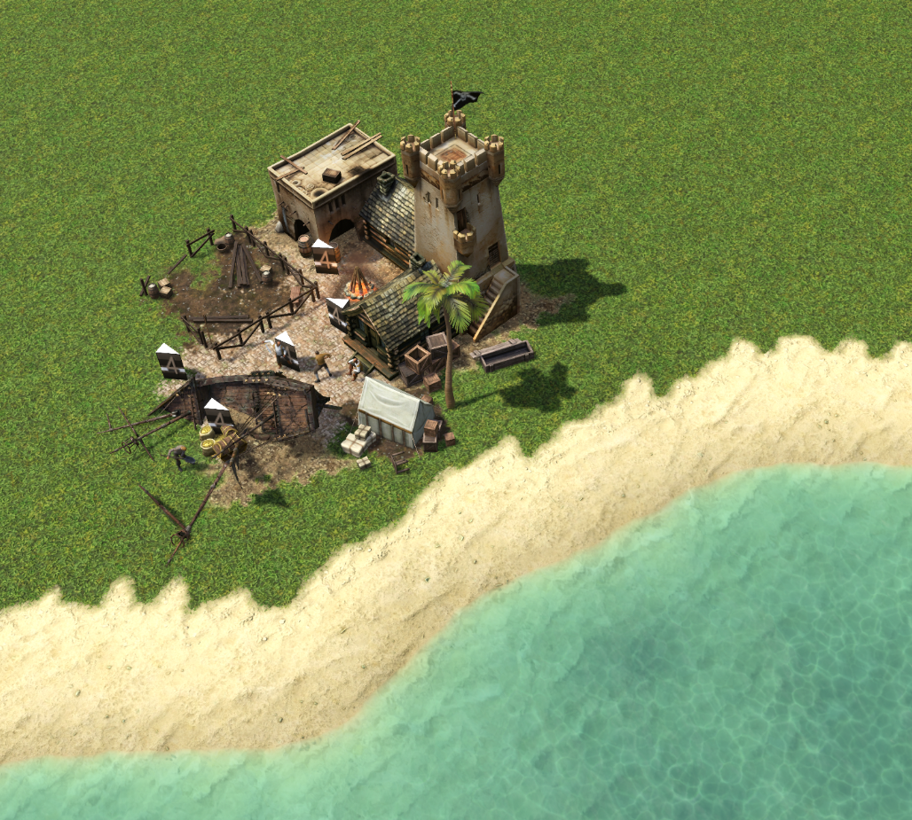

**Visual Characteristics:**

**1. Coastal Placement:**
- **ON LAND at shoreline** - NOT in water!
- **Grass terrain** with brown dirt clearing
- **Sandy beach** visible at bottom right
- **Turquoise/cyan water** adjacent to settlement
- **Perfect land-water transition** - grass → beach → water
- **Flat coastal terrain** - no steep cliffs

**2. Main Structures:**
- **Stone watchtower** with battlements (tallest structure)
- **Black pirate flag** on top of tower (Jolly Roger)
- **2-3 wooden buildings** (warehouses, barracks)
- **Thatched roofs** (brown/tan straw material)
- **Wooden construction** - rustic pirate aesthetic
- **Buildings clustered together** - condensed layout

**3. Supporting Structures:**
- **Wooden docks/piers** (visible at left side)
- **Small huts** or storage buildings
- **Tents** (white canvas tent visible)
- **Wooden crates and barrels** scattered around
- **Campfire** (visible in center area)
- **Palm tree** (tropical decoration)
- **Wooden fences** and barriers

**4. Path Blockers:**
- **~10-15 white triangular units** scattered throughout
- **Same clapperboard appearance** as all native blockers
- **Placed around perimeter** of settlement
- **Create buffer zone** preventing construction
- **Visible at edges** of the grouping

**5. Decorative Elements:**
- **Pirate flag** (black with skull and crossbones)
- **Wooden docks** extending toward water
- **Tropical vegetation** (palm tree)
- **Barrels, crates, cargo** (pirate loot aesthetic)
- **Campfire with smoke**
- **Brown dirt pathways**
- **Rustic wooden fencing**

**Key Recognition Features:**
- ✅ **Coastal placement** - land adjacent to water
- ✅ **Stone watchtower** with pirate flag
- ✅ **Wooden buildings** with thatched roofs
- ✅ **Beach/shoreline transition** visible
- ✅ **Docks/piers** present
- ✅ **Path blockers** scattered throughout
- ✅ **Pirate/maritime aesthetic**
- ✅ **ON LAND** (not floating in water)

---

##### **Example 2: Wokou Pirates (Asian Pirate Settlement)**

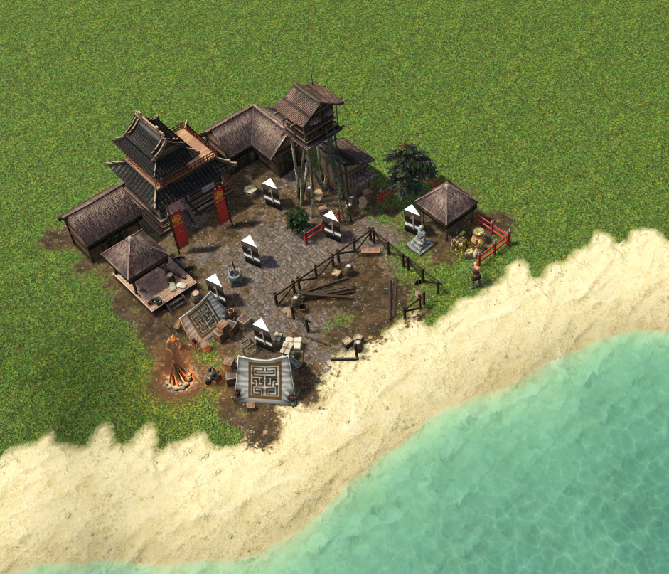

**Visual Characteristics:**

**1. Coastal Placement:**
- **ON LAND at shoreline** - NOT in water!
- **Grass terrain** with extensive brown dirt clearing
- **Wide sandy beach** visible at bottom right
- **Turquoise/cyan water** adjacent to settlement
- **Perfect land-water transition** - grass → beach → water
- **Flat coastal terrain** - ideal for Asian architecture

**2. Main Structures:**
- **5-7 Asian buildings** with distinctive architecture
- **Multi-story pagoda-style buildings** (2-3 levels)
- **Dark brown/grey tiled roofs** (Asian curved style)
- **Wooden construction** with dark brown walls
- **Thatched roofs** on smaller huts
- **Red decorative banners/flags** on some buildings
- **Watchtower structure** (tallest building at back)
- **Buildings clustered tightly** - condensed village layout

**3. Supporting Structures:**
- **Multiple small huts** (thatched roof style)
- **Wooden docks/piers** extending toward water (left side)
- **Storage buildings** and warehouses
- **Asian decorative elements** (red banners, Asian props)
- **Wooden crates and barrels** scattered throughout
- **Campfire** (visible at bottom left)
- **Trees** (Asian vegetation - bamboo or similar)
- **Wooden fences** and barriers

**4. Path Blockers:**
- **~15-20 white triangular units** scattered throughout
- **Same clapperboard appearance** as all native blockers
- **Densely placed around perimeter** of settlement
- **Create buffer zone** preventing construction
- **Visible throughout the grouping** - more numerous than Pirate Haven

**5. Decorative Elements:**
- **Red banners/flags** (Asian pirate faction colors)
- **Asian architectural details** (curved roofs, pagoda style)
- **Wooden docks** extending toward water
- **Asian vegetation** (trees, bushes)
- **Barrels, crates, cargo** scattered around
- **Campfire with smoke**
- **Brown dirt pathways** between buildings
- **Wooden fencing** (Asian style)
- **Stone decorative elements** (visible at bottom center)

**Key Recognition Features:**
- ✅ **Coastal placement** - land adjacent to water
- ✅ **Asian architecture** - pagoda-style buildings with curved roofs
- ✅ **Multiple buildings** (5-7 structures) - larger settlement than Pirate Haven
- ✅ **Red banners** - distinctive Asian pirate aesthetic
- ✅ **Beach/shoreline transition** visible
- ✅ **Docks/piers** present
- ✅ **Path blockers** scattered throughout (more numerous)
- ✅ **Asian/Oriental maritime aesthetic**
- ✅ **ON LAND** (not floating in water)

**Comparison to Pirate Haven:**
- **More buildings** - Wokou has 5-7 vs Pirates 2-3
- **Asian architecture** - Curved roofs vs European stone tower
- **Red banners** - Asian faction colors vs black Jolly Roger
- **Larger footprint** - More extensive settlement
- **More path blockers** - ~15-20 vs ~10-15
- **Same coastal requirements** - Both must be on land at shoreline

---

##### **Example 3: Scientists/Inventors (Industrial Coastal Research Facility)**

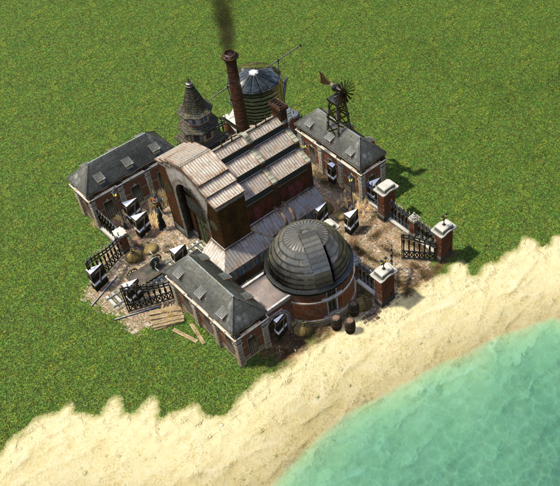

**Visual Characteristics:**

**1. Coastal Placement:**
- **ON LAND at shoreline** - NOT in water!
- **Grass terrain** with extensive brown dirt clearing
- **Wide sandy beach** visible at bottom right
- **Turquoise/cyan water** adjacent to settlement
- **Perfect land-water transition** - grass → beach → water
- **Flat coastal terrain** - suitable for industrial complex

**2. Main Structures:**
- **Large central factory building** with corrugated metal roof (cream/tan striped)
- **Two prominent domed observatories** (dark grey/blue ribbed domes)
- **Industrial chimneys/smokestacks** (tall cylindrical towers)
- **Multi-story brick buildings** (dark grey/brown walls)
- **Metal framework tower** (visible at right - industrial lattice structure)
- **Dark slate/grey roofs** on supporting buildings
- **Industrial/Victorian era architecture**
- **Condensed compound layout** - buildings very close together

**3. Supporting Structures:**
- **4-6 industrial buildings** clustered around central factory
- **Observatory domes** (2 large domed structures for scientific research)
- **Smokestack towers** (2-3 tall chimneys)
- **Metal lattice tower** (communication/observation tower)
- **Brick warehouses** and research buildings
- **Wooden dock/pier** extending toward water (right side)
- **Industrial props** (crates, barrels, equipment)
- **Metal fencing** and barriers

**4. Path Blockers:**
- **~15-20 white triangular units** scattered throughout
- **Same clapperboard appearance** as all native blockers
- **Densely placed around perimeter** of industrial complex
- **Create buffer zone** preventing construction
- **Visible throughout the grouping** - protecting research facility

**5. Decorative Elements:**
- **Industrial chimneys with smoke** (active facility indicator)
- **Domed observatories** (distinctive scientific aesthetic)
- **Metal lattice tower** (industrial framework)
- **Corrugated metal roofing** (industrial material)
- **Wooden crates and barrels** scattered around
- **Brown dirt pathways** between buildings
- **Metal/wooden fencing** (industrial style)
- **Scientific/research equipment** visible on buildings

**Key Recognition Features:**
- ✅ **Coastal placement** - land adjacent to water
- ✅ **Industrial architecture** - factories, observatories, smokestacks
- ✅ **Domed observatories** (2 large grey domes) - unique to Scientists
- ✅ **Metal lattice tower** - distinctive industrial framework
- ✅ **Corrugated metal roofs** - industrial material aesthetic
- ✅ **Active smokestacks** - smoke rising from chimneys
- ✅ **Beach/shoreline transition** visible
- ✅ **Dock/pier** present
- ✅ **Path blockers** scattered throughout
- ✅ **Scientific/industrial aesthetic**
- ✅ **ON LAND** (not floating in water)

**Comparison to Other Naval Groupings:**
- **Industrial aesthetic** - Factories and observatories vs wooden/stone buildings
- **Domed observatories** - Unique scientific structures (not present in Pirates/Wokou)
- **Metal construction** - Corrugated roofs and lattice towers vs traditional materials
- **Victorian era** - 19th century industrial revolution style
- **Medium-large footprint** - Similar size to Wokou (4-6 buildings)
- **More vertical elements** - Tall smokestacks and towers
- **Same coastal requirements** - Must be on land at shoreline

---

##### **Example 4: Venetian Trading Post (Mediterranean Maritime Settlement)**

**⚠️ SPECIAL PLACEMENT NOTE:** This grouping is **RARELY placed on coastal land** as shown in this example. It is **MOST COMMONLY placed on floating islands** in water. This example is provided for **architectural pattern recognition only**.

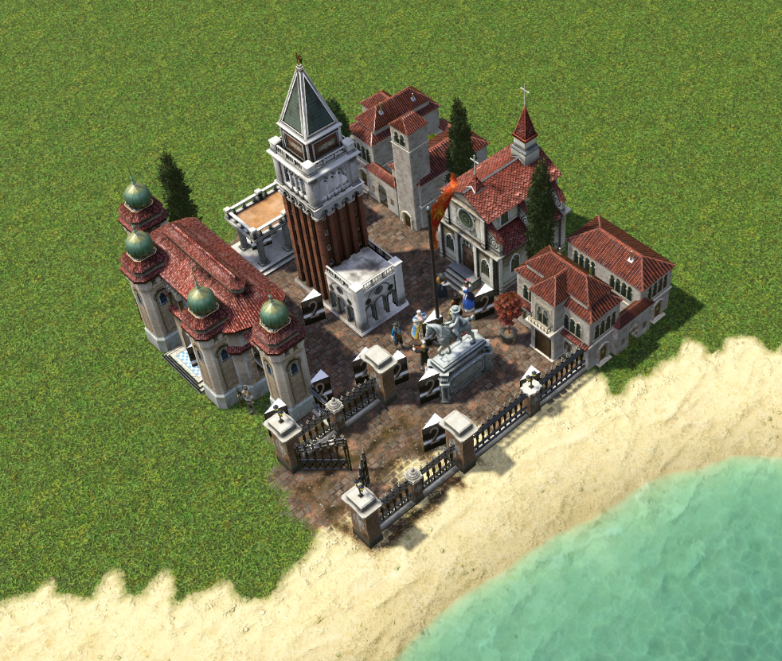

**Visual Characteristics:**

**1. Coastal Placement (Rare Configuration):**
- **ON LAND at shoreline** - NOT typical placement!
- **Grass terrain** with brown stone/tile courtyard
- **Sandy beach** visible at bottom right
- **Turquoise/cyan water** adjacent to settlement
- **Perfect land-water transition** - grass → beach → water
- **⚠️ NOTE:** Usually spawns on floating island in water, not coastal land

**2. Main Structures:**
- **Ornate Venetian cathedral/basilica** (left side) with distinctive architecture
- **Green oxidized copper domes** (3-4 domes) - iconic Venetian style
- **Red/orange terracotta tiled roofs** throughout
- **Tall bell tower/campanile** (center-left) with pyramid-shaped grey roof
- **Multi-story merchant buildings** (3-4 buildings) with cream/tan stone walls
- **Venetian Gothic architecture** - arched windows, ornate facades
- **Stone courtyard platform** with decorative paving
- **Condensed urban layout** - buildings very close together

**3. Supporting Structures:**
- **5-7 Venetian buildings** clustered tightly
- **Cathedral with multiple green domes** (largest structure)
- **Bell tower** (campanile) - tall vertical element
- **Merchant houses** with red tiled roofs
- **Stone archways** and colonnades
- **Black ornate iron fencing** at perimeter (bottom)
- **White marble/stone decorative elements**
- **Cypress trees** (dark green conical trees)
- **Stone courtyard** with brown tile/paving

**4. Path Blockers:**
- **~15-20 white triangular units** scattered throughout
- **Same clapperboard appearance** as all native blockers
- **Placed around perimeter** of settlement
- **Create buffer zone** preventing construction
- **Visible at edges** of the grouping

**5. Decorative Elements:**
- **Green oxidized copper domes** (distinctive Venetian aesthetic)
- **Red terracotta roof tiles** (Mediterranean style)
- **Black ornate iron fencing** (decorative pattern)
- **Cypress trees** (Italian vegetation)
- **Stone courtyard paving** (brown tiles)
- **White marble statues/decorations**
- **Venetian Gothic architectural details** (arches, columns)
- **Brown dirt pathways** around perimeter

**Key Recognition Features:**
- ✅ **Green oxidized copper domes** (3-4 domes) - UNIQUE to Venetian
- ✅ **Venetian Gothic architecture** - ornate facades, arched windows
- ✅ **Red terracotta roofs** - Mediterranean style
- ✅ **Tall bell tower** (campanile) - vertical landmark
- ✅ **Stone courtyard platform** - formal urban layout
- ✅ **Black ornate iron fencing** - decorative perimeter
- ✅ **Cypress trees** - Italian vegetation
- ✅ **Path blockers** scattered throughout
- ✅ **Mediterranean/Italian aesthetic**
- ⚠️ **Usually on floating island** - coastal placement is RARE

**Typical Placement:**
- **MOST COMMON:** Floating island in water (not shown in this example)
- **RARE:** Coastal land placement (as shown)
- **Purpose:** Represents Venice's island-based city structure
- **Debugging:** If placed on land, verify same coastal requirements as other naval groupings

**Comparison to Other Naval Groupings:**
- **Most ornate architecture** - Cathedral and Gothic buildings vs simpler structures
- **Green copper domes** - Unique identifier (not present in other groupings)
- **Mediterranean style** - Red terracotta roofs, Italian aesthetic
- **Urban/formal layout** - Stone courtyard vs natural/rustic settlements
- **Largest footprint** - 5-7 buildings, most complex settlement
- **Floating island placement** - Unique among naval groupings (usually)
- **Same coastal requirements** - When placed on land (rare)

---

##### **Example 5: Hanseatic Kontor (Northern European Trading Post)**

**⚠️ SPECIAL PLACEMENT NOTE:** This grouping is **RARELY placed on coastal land** as shown in this example. It is **MOST COMMONLY placed on floating islands** in water. This example is provided for **architectural pattern recognition only**.

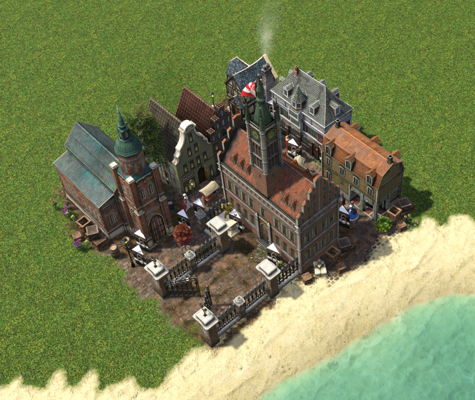

**Visual Characteristics:**

**1. Coastal Placement (Rare Configuration):**
- **ON LAND at shoreline** - NOT typical placement!
- **Grass terrain** with brown stone/brick courtyard
- **Sandy beach** visible at bottom right
- **Turquoise/cyan water** adjacent to settlement
- **Perfect land-water transition** - grass → beach → water
- **⚠️ NOTE:** Usually spawns on floating island in water, not coastal land

**2. Main Structures:**
- **Tall church/cathedral** (left side) with green oxidized copper dome roof
- **Multi-story brick merchant buildings** (4-5 buildings) - Northern European style
- **Stepped gable facades** (distinctive Hanseatic architecture)
- **Orange/brown terracotta tiled roofs** on some buildings
- **Dark grey slate roofs** on others
- **Cream/tan and grey stone walls** with timber framing
- **Red and white flags** on buildings (Hanseatic League colors)
- **Condensed urban layout** - tightly packed buildings

**3. Supporting Structures:**
- **5-6 Hanseatic buildings** clustered together
- **Church with green copper dome** (tallest structure)
- **Brick warehouses** with stepped gables (3-4 stories)
- **Merchant guild houses** with timber framing
- **Stone/brick courtyard** with brown paving
- **Black ornate iron fencing** at perimeter (bottom)
- **White canvas market tents** (visible in courtyard)
- **Wooden crates and barrels** (trading goods)
- **Chimney with smoke** (active building indicator)

**4. Path Blockers:**
- **~15-20 white triangular units** scattered throughout
- **Same clapperboard appearance** as all native blockers
- **Placed around perimeter** of settlement
- **Create buffer zone** preventing construction
- **Visible at edges** of the grouping

**5. Decorative Elements:**
- **Green oxidized copper dome** (church roof)
- **Red and white flags** (Hanseatic League colors)
- **Stepped gable facades** (distinctive Northern European style)
- **Black ornate iron fencing** (decorative perimeter)
- **White market tents** (trading activity)
- **Wooden crates and barrels** (merchant goods)
- **Chimney smoke** (active settlement)
- **Brown brick/stone courtyard paving**
- **Timber-framed buildings** (medieval construction)

**Key Recognition Features:**
- ✅ **Stepped gable facades** - UNIQUE Hanseatic architectural style
- ✅ **Red and white flags** - Hanseatic League colors
- ✅ **Green copper dome church** - Northern European style
- ✅ **Multi-story brick warehouses** (3-4 stories)
- ✅ **Timber-framed buildings** - medieval construction
- ✅ **White market tents** - trading activity
- ✅ **Black ornate iron fencing** - decorative perimeter
- ✅ **Path blockers** scattered throughout
- ✅ **Northern European/Baltic aesthetic**
- ⚠️ **Usually on floating island** - coastal placement is RARE

**Typical Placement:**
- **MOST COMMON:** Floating island in water (not shown in this example)
- **RARE:** Coastal land placement (as shown)
- **Purpose:** Represents Hanseatic League's island trading posts (e.g., Visby, Bergen)
- **Debugging:** If placed on land, verify same coastal requirements as other naval groupings

**Comparison to Other Naval Groupings:**
- **Stepped gable architecture** - Unique Northern European style
- **Red/white flags** - Hanseatic League identification
- **Brick construction** - Medieval Northern European vs Mediterranean stone
- **Timber framing** - Medieval construction technique
- **Green copper dome** - Similar to Venetian but different architectural style
- **Market tents** - Active trading aesthetic
- **Medium-large footprint** - 5-6 buildings, similar to Venetian
- **Floating island placement** - Unique among naval groupings (usually)
- **Same coastal requirements** - When placed on land (rare)

**Comparison: Venetian vs Hanseatic:**
- **Venetian:** Mediterranean/Italian, ornate Gothic, multiple green domes, cypress trees
- **Hanseatic:** Northern European/Baltic, stepped gables, single green dome, market tents
- **Both:** Usually on floating islands, green copper domes, black iron fencing, similar size
- **Venetian:** More ornate and formal, cathedral-focused
- **Hanseatic:** More commercial and functional, warehouse-focused

---

##### **Example 6: Harbour Grouping (Naval Trade Route Socket)**

**⚠️ CRITICAL DISTINCTION:** This is **NOT a native settlement grouping** like the previous examples. Harbour groupings are **TRADE ROUTE SOCKETS** similar to capturable land/naval sockets, but with a different function and appearance.

**⚠️ IMPORTANT RECOGNITION NOTE:** This grouping uses **PINK RECTANGULAR PATH BLOCKERS** instead of the standard white triangular clapperboard units. This is a **UNIQUE identifier** for harbour groupings!

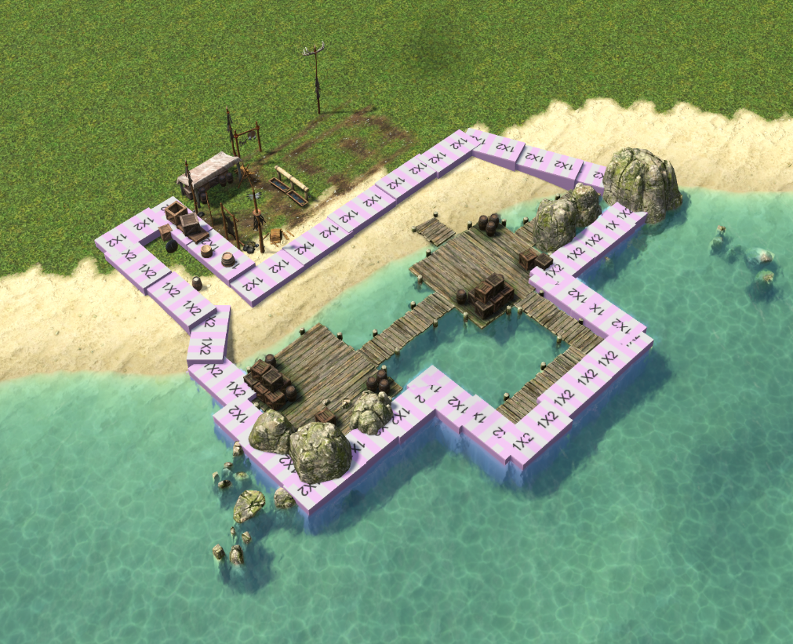

**What Are Harbour Groupings:**
- **Trade route sockets** - NOT native settlements
- **Placed along naval trade routes** (dotted white lines on minimap)
- **Same function as trade route sockets** - control points for trade income
- **No native units or technologies** - purely economic structures
- **Capturable or buildable** depending on map design
- **Larger and more complex** than standard naval sockets

**Visual Characteristics:**

**1. Coastal Placement:**
- **HYBRID placement** - Extends from land INTO water
- **Grass terrain** on land portion (upper left)
- **Wide sandy beach** transition zone
- **Turquoise/cyan water** with structures extending into it
- **Perfect land-water transition** - grass → beach → water
- **Wooden platforms IN WATER** - unique to harbour groupings
- **Flat coastal terrain** - suitable for large port facility
- **Located along naval trade routes** (dotted white lines on minimap)

**2. Main Structures (On Land):**
- **2-3 warehouse buildings** on land portion (upper left)
- **Wooden construction** with dark roofs
- **Small huts or storage buildings**
- **Watchtower/lookout structure** (tall pole with platform)
- **Minimal land footprint** - most structure is in water

**3. Dock/Pier Structures (In Water):**
- **Large wooden dock platforms** extending into water - CRITICAL FEATURE
- **Cross-shaped pier configuration** (visible in center)
- **Multiple wooden walkways** connecting platforms
- **Brown wooden planking** throughout
- **Small dock buildings** on platforms (dark structures)
- **Decorative rocks** placed on dock edges
- **Extends deep into navigable water**

**4. Path Blockers (UNIQUE TYPE):**
- **~30-40 PINK RECTANGULAR units** - COMPLETELY DIFFERENT from standard blockers!
- **NOT white triangular clapperboards** - this is the key identifier!
- **Pink/purple colored rectangles** with "X2" markings visible
- **Arranged in perimeter** around entire grouping (land AND water)
- **Create buffer zone** both on land and in water
- **Visible throughout** - forming rectangular boundary
- **CRITICAL:** Pink rectangular blockers = Harbour grouping!

**5. Decorative Elements:**
- **Wooden dock platforms** (extensive water structures)
- **Decorative rocks/boulders** on dock edges and in water
- **Small boats** visible in water (bottom right)
- **Watchtower pole** (tall vertical element on land)
- **Brown dirt pathways** on land portion
- **Minimal vegetation** - functional port aesthetic
- **Beach/sand transition** clearly visible

**Key Recognition Features:**
- ✅ **PINK RECTANGULAR path blockers** - UNIQUE identifier (not white triangular!)
- ✅ **Wooden platforms IN WATER** - extensive dock structures
- ✅ **Cross-shaped pier configuration** - distinctive layout
- ✅ **Hybrid land-water placement** - extends from shore into water
- ✅ **Minimal land structures** - focus on water infrastructure
- ✅ **Decorative rocks** on dock edges
- ✅ **Beach/shoreline transition** visible
- ✅ **Functional port aesthetic** - industrial/commercial
- ✅ **"X2" markings on blockers** - visible on pink rectangles

**Orientation & Naming Convention:**

**This example shows:** `Harbour_Universal_SE` or `Harbour_Center_SE` grouping

**8 Directional Variants Available:**

All harbour groupings come in **8 cardinal/ordinal directions** to orient docks toward water:

| Direction | Suffix | Dock Faces | Visual Cue in Screenshot |
|-----------|--------|------------|--------------------------|
| **North** | `_N` | North | Docks extend toward top of screen |
| **Northeast** | `_NE` | Northeast | Docks extend toward top-right diagonal |
| **East** | `_E` | East | Docks extend toward right side |
| **Southeast** | `_SE` | Southeast | Docks extend toward bottom-right diagonal ✅ **THIS EXAMPLE** |
| **South** | `_S` | South | Docks extend toward bottom of screen |
| **Southwest** | `_SW` | Southwest | Docks extend toward bottom-left diagonal |
| **West** | `_W` | West | Docks extend toward left side |
| **Northwest** | `_NW` | Northwest | Docks extend toward top-left diagonal |

**Two Grouping Families:**

1. **`Harbour_Universal_[Direction]`** - For maps with multiple trade routes or complex layouts
   - Examples: `Harbour_Universal_SE`, `Harbour_Universal_NW`, etc.
   - Can be used with any number of trade routes

2. **`Harbour_Center_[Direction]`** - For maps with a **single central trade route only**
   - Examples: `Harbour_Center_SE`, `Harbour_Center_NW`, etc.
   - Should only be used when there is exactly one trade route on the map
   - Special variants: `Harbour_Center_River_NE`, `Harbour_Center_River_SW` (for river routes)

**How to Identify Orientation from Screenshot:**

Look at which direction the **wooden dock platforms extend into the water**:

**Visual Orientation Guide:**
```
         N (Top)
         ↑
    NW ↖ | ↗ NE
         |
W ←------+------→ E
         |
    SW ↙ | ↘ SE ✅ THIS EXAMPLE
         ↓
         S (Bottom)
```

**Identification by Dock Direction:**
- **N:** Docks extend toward **top** of screen (water to north)
- **NE:** Docks extend toward **top-right diagonal** (water to northeast)
- **E:** Docks extend toward **right** side (water to east)
- **SE:** Docks extend toward **bottom-right diagonal** ✅ **THIS EXAMPLE**
- **S:** Docks extend toward **bottom** of screen (water to south)
- **SW:** Docks extend toward **bottom-left diagonal** (water to southwest)
- **W:** Docks extend toward **left** side (water to west)
- **NW:** Docks extend toward **top-left diagonal** (water to northwest)

**Rule:** The suffix indicates where the **water is located** relative to the harbour. Docks always extend toward the water.

**Additional Variability:**
- **Building design varies** by biome type (tropical, temperate, etc.)
- **Orientation must match** water direction for proper placement
- **Dock configuration** is fixed per orientation variant
- **Cross-shaped pier** rotates to match orientation

**Typical Placement:**
- **Along naval trade routes** (dotted white lines on minimap)
- **ON LAND at shoreline** with structures extending into water
- **Requires deep navigable water** for dock platforms
- **Beach transition essential** for land-water connection
- **Orientation varies** - docks face toward water (any direction)
- **Strategic control points** for water-based trade routes

**Purpose & Function:**
- **Trade route control** - Capture or build to gain trade income
- **NOT for native alliances** - No native units or technologies
- **Economic structures only** - Purely for trade route income
- **Similar to capturable naval sockets** but larger and more complex
- **Part of trade route network** - Connected to water trade routes

**Debugging Use:**
- **Check for pink rectangular blockers** - if present, it's a harbour grouping
- **Verify placement along naval trade route** - should be near dotted white line
- **Verify dock platforms in water** - should extend into navigable water
- **Confirm land-water hybrid placement** - not entirely on land or water
- **Check water depth** - must be sufficient for dock structures
- **Verify beach transition** - smooth gradient from land to water
- **Validate blocker perimeter** - pink rectangles should surround entire grouping
- **Confirm NO native units** - should not spawn native villagers/warriors

**Comparison to Native Naval Groupings:**
- **NOT a native settlement** - Trade route socket vs native alliance site
- **No native units** - No villagers or warriors (unlike Pirates, Wokou, etc.)
- **UNIQUE path blockers** - Pink rectangles vs white triangular clapperboards
- **Hybrid placement** - Extends into water vs entirely on land
- **Dock-focused** - Wooden platforms in water vs land buildings
- **Minimal land structures** - 2-3 buildings vs 5-7 in native settlements
- **Functional aesthetic** - Industrial port vs settlement/village
- **Largest water footprint** - Extensive dock platforms
- **Orientation-dependent** - Adapts to water direction
- **Biome-variable** - Building design changes with map theme
- **Trade route function** - Economic control point vs native technology source

**Common Issues:**
- **Dock platforms on land** - Water too shallow or placement error
- **Missing pink blockers** - Incomplete spawn or wrong grouping type
- **Dock clipping through terrain** - Water depth insufficient
- **Wrong orientation** - Docks facing away from water
- **Beach transition missing** - Abrupt land-water boundary
- **Overlapping with other objects** - Insufficient constraint separation

---

##### **CRITICAL DEBUGGING CHECKLIST FOR NAVAL GROUPINGS**

**⚠️ Most Common Failures - Check These First:**

**1. Placement Location:**
- [ ] **Grouping is ON LAND** (not in water!) - MOST COMMON ERROR
- [ ] Grouping is at shoreline (land-water transition)
- [ ] Beach/sand terrain visible between land and water
- [ ] Water is adjacent (within 5-10 meters)
- [ ] No steep cliffs blocking placement
- [ ] Coastal angle is appropriate (not too steep)

**2. Water Requirements:**
- [ ] Water is navigable (not shallow/decorative water)
- [ ] Water depth sufficient for ships (if applicable)
- [ ] Water extends far enough from shore
- [ ] No underwater terrain blocking ship spawns
- [ ] Water type matches map theme

**3. Terrain Validation:**
- [ ] Grass terrain transitions to beach/sand
- [ ] Beach transitions to water
- [ ] No cliff edges cutting through grouping
- [ ] Elevation is appropriate (near sea level)
- [ ] Terrain is relatively flat (not steep slope)

**4. Complete Spawn Verification:**
- [ ] All buildings present (tower, warehouses, huts)
- [ ] Docks/piers spawned correctly
- [ ] Path blockers visible around perimeter
- [ ] Decorative elements present (flags, crates, vegetation)
- [ ] No buildings clipping through terrain
- [ ] No structures floating in air

**5. Water Flag Placement (If Applicable):**
- [ ] Water flag spawned in water (not on land)
- [ ] Flag accessible from shore
- [ ] Flag in navigable water depth
- [ ] Flag not too far from settlement
- [ ] Correct flag type for faction (Pirate Jolly Roger, etc.)

---

##### **Common Naval Grouping Errors and Solutions**

**ERROR 1: Grouping Spawned in Water**
- **Symptom:** Buildings floating on water surface
- **Cause:** Incorrect placement coordinates or constraint failure
- **Solution:** 
  - Verify `rmAddGroupingConstraint()` includes water avoidance
  - Check placement coordinates are on land terrain
  - Ensure coastal constraint allows land placement
  - Test with `rmSetGroupingMinDistance()` from water edge

**ERROR 2: No Beach Transition**
- **Symptom:** Grouping on grass far from water, or directly in water
- **Cause:** Missing beach terrain between land and water
- **Solution:**
  - Add beach/sand terrain at shoreline
  - Use `rmSetAreaTerrainType()` for beach areas
  - Ensure smooth terrain transition (grass → sand → water)
  - Check map has proper coastal generation

**ERROR 3: Water Too Shallow**
- **Symptom:** Ships can't spawn, water flag on land
- **Cause:** Water depth insufficient near shore
- **Solution:**
  - Increase water area size
  - Verify water type is navigable (not "shallow water")
  - Check underwater terrain elevation
  - Ensure water extends far enough from shore

**ERROR 4: Steep Cliffs at Coast**
- **Symptom:** Grouping fails to spawn, or spawns on cliff edge
- **Cause:** Coastal cliffs too steep for placement
- **Solution:**
  - Add `rmAddGroupingConstraint()` to avoid cliffs
  - Smooth coastal elevation with `rmSetAreaHeightBlend()`
  - Use gentler coastal slopes
  - Test placement with different coastal angles

**ERROR 5: Partial Spawn**
- **Symptom:** Some buildings missing, docks not present
- **Cause:** Terrain constraints blocking some elements
- **Solution:**
  - Increase cleared area size around placement point
  - Verify all grouping elements have valid terrain
  - Check for overlapping constraints
  - Test with `rmSetGroupingMaxDistance()` adjustments

**ERROR 6: Overlapping with Other Objects**
- **Symptom:** Grouping spawns on top of resources/trade routes
- **Cause:** Insufficient constraint separation
- **Solution:**
  - Add constraints for resources, trade routes, other groupings
  - Increase minimum distance values
  - Use class-based constraints for better control
  - Verify constraint order in script

---

##### **Naval Grouping Placement Best Practices**

**Code Pattern for Coastal Placement:**

```xs
// 1. Create coastal constraint (avoid deep water, allow shoreline)
int coastalConstraint = rmCreateTerrainDistanceConstraint("coastal", "water", true, 0.0, 15.0);
// Allows placement 0-15 meters from water edge

// 2. Avoid cliffs
int avoidCliff = rmCreateTerrainDistanceConstraint("avoid cliff", "cliffNonPassable", true, 10.0, -1);

// 3. Create grouping
int pirateHavenID = rmCreateGrouping("pirate haven", "Pirate_Haven_Grouping");

// 4. Add constraints
rmAddGroupingConstraint(pirateHavenID, coastalConstraint);  // Near water
rmAddGroupingConstraint(pirateHavenID, avoidCliff);         // Avoid cliffs
rmAddGroupingConstraint(pirateHavenID, avoidImpassableLand); // On passable land

// 5. Place at coastal location
rmPlaceGroupingAtLoc(pirateHavenID, 0, coastalX, coastalZ, 1);
```

**Key Principles:**
1. **Always constrain to land** - Use terrain constraints to avoid water
2. **Allow proximity to water** - Use distance constraint 0-15 meters from water
3. **Avoid cliffs** - Coastal cliffs cause placement failures
4. **Test multiple locations** - Have fallback placement points
5. **Verify water depth** - Ensure navigable water nearby
6. **Check beach terrain** - Smooth land-water transition required

---

##### **Naval Grouping Types Summary**

**⚠️ IMPORTANT DISTINCTION:**
- **Examples 1-5** = **NATIVE SETTLEMENT GROUPINGS** (provide native units and technologies)
- **Example 6** = **TRADE ROUTE SOCKET** (provides trade income only, NO native units)

---

**NATIVE SETTLEMENT GROUPINGS (Provide native alliances):**

**Standard Coastal Placement (ON LAND at shoreline):**
- ✅ **Pirate Havens** (Example 1) - European coastal pirate settlements
  - White triangular path blockers
  - Native units and technologies
- ✅ **Wokou Pirates** (Example 2) - Asian pirate bases
  - White triangular path blockers
  - Native units and technologies
- ✅ **Scientists/Inventors** (Example 3) - Industrial coastal research facilities
  - White triangular path blockers
  - Native units and technologies

**Special Floating Island Placement (Usually IN WATER on islands):**
- ✅ **Venetian Trading Posts** (Example 4) - Mediterranean maritime settlements (RARELY on coastal land)
  - White triangular path blockers
  - Native units and technologies
- ✅ **Hanseatic Kontors** (Example 5) - Northern European trading posts (RARELY on coastal land)
  - White triangular path blockers
  - Native units and technologies

**Additional Native Naval Grouping Types (Examples Coming):**
- ⏳ **Naval Academies** - Military naval training facilities
- ⏳ **Fishing Villages** - Coastal resource settlements
- ⏳ **Lighthouse Complexes** - Navigation and defense structures

---

**TRADE ROUTE SOCKETS (Provide trade income only):**

**Naval Trade Route Sockets:**
- ✅ **Harbour Groupings** (Example 6) - Large port facilities with docks
  - **PINK RECTANGULAR path blockers** (UNIQUE identifier!)
  - **NO native units** - trade route socket only
  - Placed along naval trade routes (dotted white lines)
  - Hybrid land-water placement (extends into water)

**Land Trade Route Sockets (Armored Trains):**
- ✅ **Train Station Groupings** (Example 7) - Railway stations for armored trains
  - **PINK CLICKABLE AREA** (magenta grid in editor - UNIQUE identifier!)
  - **NO native units** - trade route socket only
  - Placed along land trade routes (solid white lines)
  - Only on armored train maps
  - Two-layer system (skeleton + building)

---

**Key Distinctions:**

**By Function:**
- **Native Settlement Groupings** (Examples 1-5) → Provide native units and technologies
- **Trade Route Sockets** (Examples 6-7) → Provide trade income only, NO natives

**By Placement Type:**
- **Coastal Naval Groupings** (Pirates, Wokou, Scientists) → Always ON LAND at shoreline
- **Floating Island Groupings** (Venetian, Hanseatic) → Usually IN WATER on floating islands
- **Hybrid Naval Groupings** (Harbour) → Extends from land INTO water with dock platforms
- **Land Trade Route Groupings** (Train Station) → ON FLAT LAND along armored train routes

**By Identifier Type:**
- **White Triangular Clapperboards** → All native settlement groupings (Examples 1-5)
- **Pink Rectangular Blockers** → Harbour trade route sockets (Example 6)
- **Pink Clickable Area** (magenta grid in editor) → Train station groupings (Example 7)

**By Trade Route Type:**
- **Naval Trade Routes** (dotted white lines) → Harbour groupings
- **Land Trade Routes** (solid white lines) → Train station groupings (armored trains only)

**Quick Identification:**
- See **pink clickable area** (magenta grid)? → **Train Station Grouping (Armored Train Socket)**
- See **pink rectangular blockers**? → **Harbour Grouping (Naval Trade Route Socket)**
- See white triangular blockers + green copper domes? → **Venetian or Hanseatic (Native)**
- See white triangular blockers + industrial domes? → **Scientists (Native)**
- See white triangular blockers + Asian architecture? → **Wokou Pirates (Native)**
- See white triangular blockers + pirate flag? → **Pirate Haven (Native)**

*Additional naval grouping examples will be added as they become available*

---

#### **G. Train Station Groupings (Armored Train Trade Routes)**

**⚠️ CRITICAL DISTINCTION:** Train station groupings are **TRADE ROUTE SOCKETS** (like harbour groupings), NOT native settlements. They work **ONLY on maps with armored train trade routes**.

**⚠️ DO NOT CONFUSE WITH:** Train station capturable sockets - these are different objects that work slightly differently!

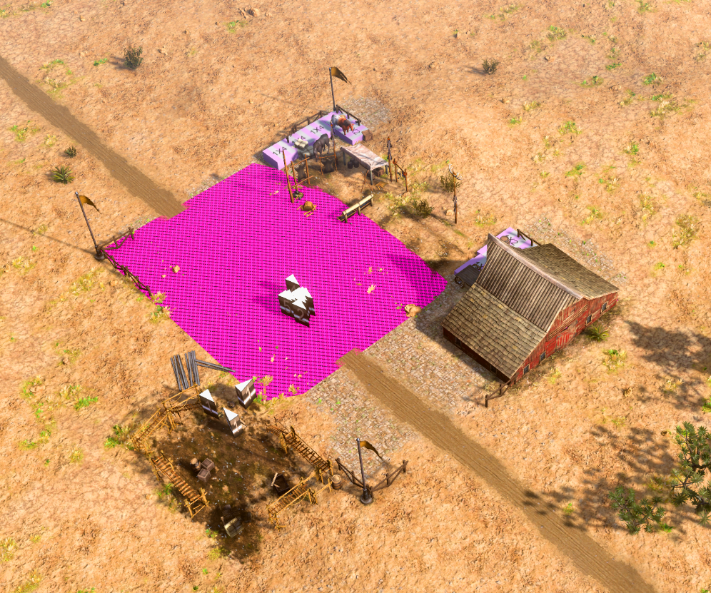

**What Are Train Station Groupings:**
- **Trade route sockets** for armored train routes - NOT native settlements
- **Placed along land trade routes** (solid white lines on minimap)
- **Same function as trade route sockets** - control points for trade income
- **No native units or technologies** - purely economic structures
- **Only work on armored train maps** - Mississippi, Blue Mountains, Wild West, etc.
- **Two-layer system** - skeleton grouping (with socket) + building grouping (visual)

---

**Visual Characteristics:**

**1. PINK CLICKABLE AREA (Editor Only - UNIQUE IDENTIFIER):**
- **Large magenta/pink highlighted area** - CRITICAL recognition feature!
- **Grid pattern texture** visible on pink area
- **Only visible in editor** - NOT visible in actual gameplay
- **Used for debugging** - helps identify station placement in editor screenshots
- **Covers the functional socket area** where players can build/capture
- **Similar to pink rectangular blockers** but much larger clickable zone

**2. Station Platform & Infrastructure:**
- **Railway tracks** running through the station (brown/dark rails)
- **Wooden platform** structures (light brown planking)
- **Station building** (warehouse-style with grey/brown roof)
- **Flag pole** with flag (visible at top)
- **Decorative props** - barrels, crates, equipment
- **Small vegetation** - bushes, small trees around perimeter

**3. Supporting Structures:**
- **Station building** - main warehouse/depot structure
- **Platform canopy** - covered waiting area (light purple/white canvas)
- **Railway infrastructure** - tracks, signals, equipment
- **Loading area** - open space for cargo
- **Decorative elements** - period-appropriate props

**4. Path Blockers:**
- **NOT visible in this screenshot** (may use standard blockers or none)
- **Pink clickable area serves similar function** - prevents building overlap
- **Different from harbour groupings** - no pink rectangular blockers visible

---

**Key Recognition Features:**
- ✅ **PINK CLICKABLE AREA** (magenta grid) - UNIQUE identifier in editor screenshots
- ✅ **Railway tracks** running through structure
- ✅ **Station building** with platform canopy
- ✅ **Flag pole** on structure
- ✅ **Placed along land trade routes** (solid white lines on minimap)
- ✅ **NO native units** - trade route socket only
- ✅ **Only on armored train maps**

---

**Orientation & Naming Convention:**

**Naming Pattern:** `Railway_Station_Big_[Direction]_[Type]`

**4 Directional Variants (NOT 8 like harbours):**

| Direction | Suffix | Track Orientation | Why Only 4? |
|-----------|--------|-------------------|-------------|
| **North** | `_N` | North-South | Also works as South from opposite side |
| **East** | `_E` | East-West | Also works as West from opposite side |
| **Southeast** | `_SE` | NW-SE diagonal | Also works as NW from opposite side |
| **Southwest** | `_SW` | NE-SW diagonal | Also works as NE from opposite side |

**Why Only 4 Directions?**
- Train stations overflow on **BOTH SIDES** of the trade route
- Creates bilateral symmetry
- Same grouping works from either viewing direction
- Unlike harbours (which face one direction), stations are symmetrical

**Type Suffix (Two-Layer System):**

| Suffix | Description | Contains Socket | Purpose |
|--------|-------------|----------------|---------|
| `_nostation` | Skeleton/platform only | ✅ Yes | Infrastructure layer with functional socket |
| `_stationA` | Station building variant A | ❌ No | Visual building for Trade Route 1 |
| `_stationB` | Station building variant B | ❌ No | Visual building for Trade Route 2 |

**A/B Variant Rule:**
- **Trade Route 1** → Use `stationA` variant
- **Trade Route 2** → Use `stationB` variant
- Both variants visually identical but assigned to different routes

**Complete Naming Examples:**
```
Railway_Station_Big_N_nostation   (skeleton with socket)
Railway_Station_Big_N_stationA    (building for Route 1)
Railway_Station_Big_N_stationB    (building for Route 2)

Railway_Station_Big_E_nostation   (skeleton with socket)
Railway_Station_Big_E_stationA    (building for Route 1)
Railway_Station_Big_E_stationB    (building for Route 2)

Railway_Station_Big_SE_nostation  (skeleton with socket)
Railway_Station_Big_SE_stationA   (building for Route 1)
Railway_Station_Big_SE_stationB   (building for Route 2)

Railway_Station_Big_SW_nostation  (skeleton with socket)
Railway_Station_Big_SW_stationA   (building for Route 1)
Railway_Station_Big_SW_stationB   (building for Route 2)
```

---

**Typical Placement:**
- **Along land trade routes** (solid white lines on minimap)
- **ON FLAT TERRAIN** - requires level ground for tracks
- **Trade route passes THROUGH station** - not over or under
- **Armored train maps only** - Mississippi, Blue Mountains, Wild West, etc.
- **Strategic control points** for armored train trade routes

**Purpose & Function:**
- **Trade route control** - Build or capture to gain trade income
- **NOT for native alliances** - No native units or technologies
- **Economic structures only** - Purely for trade route income
- **Armored train support** - Enables armored train spawning
- **Part of trade route network** - Connected to land trade routes

---

**Debugging Use:**
- **Check for pink clickable area** - if present in editor, it's a train station grouping
- **Verify placement along land trade route** - should be on solid white line
- **Confirm railway tracks present** - tracks must run through station
- **Check terrain flatness** - steep terrain causes placement failures
- **Verify TWO groupings placed** - skeleton (_nostation) + building (_stationA/B)
- **Confirm NO native units** - should not spawn native villagers/warriors
- **Validate armored train map** - only works on maps with armored trains

---

**Common Issues:**
- **Station off trade route** - Not aligned with white line on minimap
- **Tracks misaligned** - Railway tracks don't connect properly
- **Terrain too steep** - Elevation changes prevent placement
- **Missing skeleton grouping** - Only building placed, no functional socket
- **Missing building grouping** - Only skeleton placed, no visual structure
- **Wrong A/B variant** - StationA on Route 2 or StationB on Route 1
- **Direction mismatch** - Skeleton and building use different directions
- **Overlapping with other objects** - Insufficient constraint separation
- **Not an armored train map** - Train stations don't work on regular trade routes

---

**Comparison to Harbour Groupings:**

| Feature | Harbour Groupings | Train Station Groupings |
|---------|-------------------|-------------------------|
| **Function** | Naval trade route sockets | Land trade route sockets (armored trains) |
| **Path Blockers** | Pink rectangular blockers | None visible (pink clickable area instead) |
| **Editor Identifier** | Pink rectangular units | Large pink clickable area (magenta grid) |
| **Directions** | 8 variants (N, NE, E, SE, S, SW, W, NW) | 4 variants (N, E, SE, SW) |
| **Symmetry** | One-directional (faces water) | Bilateral (works both ways) |
| **Placement** | Coastal (land-water hybrid) | Flat land along trade route |
| **Grouping Layers** | Single grouping | Two layers (skeleton + building) |
| **Trade Route Type** | Naval (dotted white lines) | Land armored train (solid white lines) |
| **Map Requirement** | Any map with naval routes | Armored train maps only |

---

**Comparison to Train Station Capturable Sockets:**

**⚠️ IMPORTANT:** Train station groupings and train station capturable sockets are **DIFFERENT objects**:

- **Train Station Grouping** - Pre-built station with skeleton + building layers
- **Train Station Capturable Socket** - Simpler capturable socket object
- **Different functionality** - Work slightly differently in gameplay
- **Don't confuse them** - They are separate object types

---

#### **H. City Block Groupings (Urban Maps Only)**

**⚠️ CRITICAL DISTINCTION:** City blocks are **NOT trade route sockets** - they are **urban decorative/functional groupings** that create city landscapes on urban-themed maps.

**⚠️ IMPORTANT:** City blocks use **WHITE TRIANGULAR PATH BLOCKERS** (same as native settlements), NOT pink rectangular blockers!

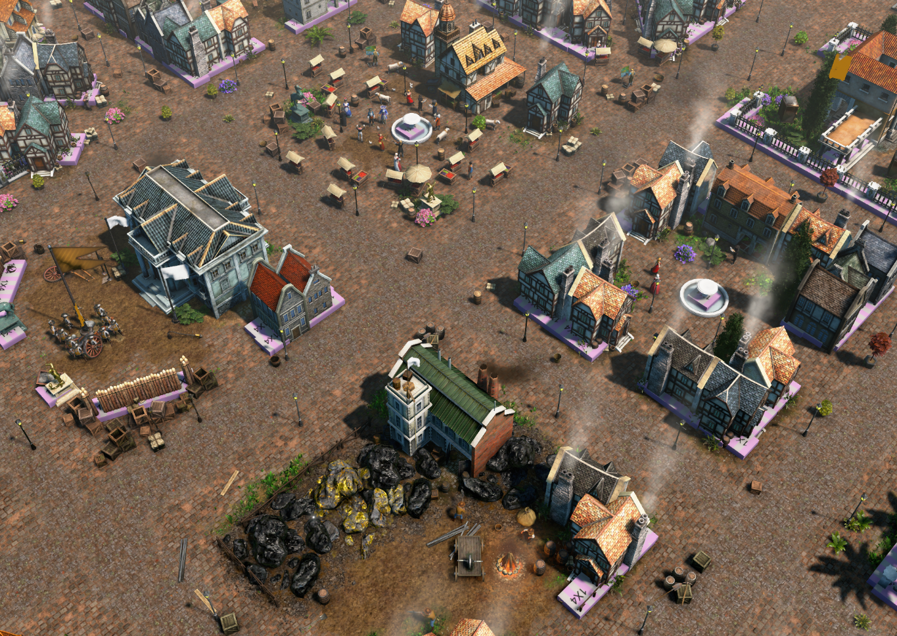

**What Are City Block Groupings:**
- **Pre-built urban sections** representing city districts and neighborhoods
- **Square-shaped groupings** with standardized dimensions (15×15 meters typical)
- **Multiple blocks per map** - Create complete urban landscapes (6-7+ blocks visible in example)
- **Organized rectangular layout** - Planned city grid pattern
- **Urban aesthetic** - European/Asian architecture depending on map region
- **May contain native settlements** - Some blocks have native sockets (with `_native` in name)
- **Decorative and functional** - Add visual diversity and strategic control points

---

**Visual Characteristics:**

**1. Square Footprint (CRITICAL IDENTIFIER):**
- **15×15 meter standard size** - Most common city block dimension
- **28×28 meter double blocks** - For larger structures (palaces, 2×2 multi-blocks)
- **Rectangular organized layout** - Urban planning grid pattern
- **Defined edges** - Clear boundaries unlike organic village layouts
- **Multiple blocks arranged** - Form city streets and districts

**2. Path Blockers:**
- **WHITE TRIANGULAR clapperboard units** - Same as native settlement blockers
- **NOT pink rectangular blockers** - That's harbour/trade route groupings!
- **Scattered around perimeter** - Form boundary of each block
- **10-20 blockers per block** - Prevent construction within block area
- **Film slate appearance** - Black base with white striped top

**3. Urban Ground Surface:**
- **Brown dirt/cobblestone terrain** - City street surface
- **NOT grass** - Urban paving throughout the block
- **Stone or dirt texture** - Represents city streets and plazas
- **Clear distinction** from surrounding terrain (grass/natural ground)
- **Defined tile pattern** - Organized street layout

**4. Building Density:**
- **3-8 buildings per block** - Compact urban density
- **Multi-story structures** - 2-4 story buildings typical
- **Varied building types** - Residential, commercial, civic buildings
- **Close spacing** - Buildings arranged along "streets"
- **European or Asian styles** - Depends on map region (EU_, IT_, AS_ prefix)

**5. Architectural Styles:**

**European Blocks (EU_ prefix):**
- **European colonial architecture** - Timber-framed, stone buildings
- **Orange/terracotta tiled roofs** - Mediterranean style
- **Multi-story townhouses** - 2-4 stories
- **Cream/tan colored walls** - Stone or plaster facades
- **Decorative elements** - Balconies, shutters, chimneys

**Italian Blocks (IT_ prefix):**
- **Italian Renaissance architecture** - Stone buildings, arched windows
- **Red terracotta roofs** - Classic Italian style
- **Ornate facades** - Decorative stonework
- **Similar to EU blocks** - But more Mediterranean aesthetic

**Asian Blocks (AS_ prefix - if present):**
- **Asian architecture** - Pagoda-style roofs, wooden construction
- **Curved roof lines** - Traditional Asian design
- **Dark wooden buildings** - Brown/grey color palette

**6. Urban Props & Details:**
- **Market stalls/tents** - White canvas tents in plazas (visible in center of image)
- **Street furniture** - Barrels, crates, boxes
- **Decorative vegetation** - Small trees, potted plants, bushes
- **Street lamps/poles** - Urban lighting fixtures
- **Statues/fountains** - Civic monuments (in some blocks)
- **Minimal natural vegetation** - Urban environment aesthetic

---

**Key Recognition Features:**

- ✅ **Square 15×15 meter footprint** - Standard block size (CRITICAL)
- ✅ **White triangular path blockers** - NOT pink rectangles!
- ✅ **Brown dirt/cobblestone ground** - Urban street surface
- ✅ **Multiple buildings per block** (3-8 structures)
- ✅ **Rectangular organized layout** - Grid pattern
- ✅ **Multi-story buildings** - 2-4 stories typical
- ✅ **Urban props** - Market stalls, barrels, street furniture
- ✅ **European/Asian architecture** - Regional style variation
- ✅ **Multiple blocks visible** - 6-7+ blocks form city landscape

---

**Block Types & Naming Convention:**

**Standard City Blocks (Non-Native):**
- **Naming:** `[Region]_House_Block_[Number]`
- **Examples:** `EU_House_Block_01`, `EU_House_Block_02`, `IT_House_Block_01`
- **Size:** 15×15 meters
- **Function:** Decorative urban structures
- **Properties:** `<selectassingleunit>0</selectassingleunit>` (not selectable as single unit)

**Native City Blocks:**
- **Naming:** `[Region]_Native_Block_[Tribe]`
- **Examples:** `EU_Native_Block_Jesuit`, `EU_Native_Block_Maltese`, `IT_Native_Block_Auditore`
- **Size:** 15×15 meters
- **Function:** Native settlement within city block
- **Contains:** Native socket site, native buildings, native units
- **Properties:** `<selectassingleunit>1</selectassingleunit>` (selectable as single unit)

**Resource Blocks:**
- **Naming:** `[Region]_Resource_Block_[Type][Number]`
- **Examples:** `EU_Resource_Block_Food1`, `EU_Resource_Block_Gold1`, `EU_Resource_Block_Wood1`
- **Size:** 15×15 meters
- **Function:** Resource-themed urban blocks (markets, mines, lumber yards)

**Special Blocks:**
- **Naming:** `[Region]_SPC_Block_[Type]`
- **Examples:** `EU_SPC_Block_TownHall`, `EU_SPC_Block_Military`, `EU_SPC_Block_Trade`
- **Size:** 15×15 meters
- **Function:** Special civic buildings (town halls, military barracks, trade centers)

**Double/Multi Blocks:**
- **Naming:** `[Region]_Palace_DoubleBlock` or `[Region]_[Name]_2x2`
- **Examples:** `EU_Palace_DoubleBlock`
- **Size:** 28×28 meters (approximately 2× standard)
- **Function:** Large structures like palaces, cathedrals, major civic buildings
- **Note:** 1×2 or 2×2 configurations for bigger structures

---

**Typical Placement:**
- **Urban-themed maps only** - Not on wilderness/rural maps
- **ON FLAT TERRAIN** - Requires level ground for city streets
- **Grid pattern arrangement** - Organized city layout
- **Multiple blocks together** - Form complete city districts
- **Along or near trade routes** - Urban centers often have trade routes
- **Strategic locations** - City centers, important map areas

**Purpose & Function:**
- **Visual diversity** - Create realistic urban environments
- **Strategic control points** - Some blocks contain capturable buildings
- **Native alliances** - Native blocks provide native units/technologies
- **Resource access** - Resource blocks provide food/gold/wood
- **Map aesthetics** - Historical city representation
- **Gameplay variety** - Different from wilderness maps

---

**Debugging Use:**
- **Count blocks** - Verify expected number spawned (6-7+ typical)
- **Check square footprint** - Should be 15×15 or 28×28 meters
- **Verify white triangular blockers** - NOT pink rectangles
- **Confirm brown ground** - Urban street surface present
- **Check building count** - 3-8 buildings per standard block
- **Verify complete spawn** - All buildings and props present
- **Check terrain flatness** - Blocks require level ground
- **Validate spacing** - Blocks shouldn't overlap
- **Confirm architectural style** - Matches map region (EU/IT/AS)

---

**Common Issues:**
- **Blocks overlapping** - Insufficient spacing between blocks
- **Terrain too steep** - Elevation changes prevent placement
- **Missing buildings** - Partial spawn due to terrain constraints
- **Wrong ground texture** - Brown street surface not applied
- **Blockers missing** - Path blockers didn't spawn
- **Rotation problems** - Blocks facing wrong direction (rare)
- **Blocks on wrong terrain** - Placed on grass instead of urban area
- **Incomplete city layout** - Not enough blocks spawned
- **Blocks too close to water/cliffs** - Constraint violations

---

**Comparison to Other Groupings:**

| Feature | City Blocks | Native Settlements | Harbour Groupings |
|---------|-------------|-------------------|-------------------|
| **Footprint** | Square 15×15m | Circular/organic | Hybrid land-water |
| **Path Blockers** | White triangular | White triangular | Pink rectangular |
| **Ground Surface** | Brown urban streets | Natural terrain | Beach/dock platforms |
| **Function** | Urban decoration | Native alliances | Trade route sockets |
| **Building Count** | 3-8 buildings | 5-7 buildings | 2-3 land buildings + docks |
| **Layout** | Rectangular grid | Circular ring | Linear coastal |
| **Placement** | Flat urban terrain | Any passable land | Coastal shoreline |
| **Map Type** | Urban maps only | Any map type | Naval maps only |
| **Native Units** | Only if `_native` block | Yes (always) | No |
| **Size Variants** | 15×15 or 28×28 | Variable | Directional variants |

---

**Quick Identification:**
- See **square 15×15m footprint** + **white triangular blockers** + **brown streets**? → **City Block**
- See **square block** + **native socket in center**? → **Native City Block** (e.g., Jesuit, Maltese)
- See **28×28m large block** + **palace/cathedral**? → **Double Block** (multi-block)
- See **pink rectangular blockers**? → **NOT a city block** - That's a harbour grouping!
- See **circular layout** + **white blockers**? → **Native settlement** (not city block)

---

**Regional Variations:**

**EU (European) City Blocks:**
- European colonial architecture
- Orange/terracotta roofs
- Timber-framed buildings
- Examples: `EU_House_Block_01` through `EU_House_Block_06`

**IT (Italian) City Blocks:**
- Italian Renaissance architecture
- Red terracotta roofs
- Stone facades with arched windows
- Examples: `IT_House_Block_01` through `IT_House_Block_06`

**AZ (Aztec) City Blocks:**
- Mesoamerican architecture
- Stone pyramids and temples
- Examples: `AZ_House_Block_01`, `AZ_Big_House1`

---

### **6. 📋 GROUPING RECOGNITION GUIDE**

**How to Identify Groupings in Screenshots:**

1. **Look for clusters** - Multiple buildings/objects together
2. **Check symmetry** - Groupings have designed layouts
3. **Identify theme** - Coastal, urban, military, native
4. **Verify completeness** - All expected elements present
5. **Check placement** - Proper terrain and constraints

**Common Grouping Issues:**
- **Partial spawn** - Only some buildings appeared
- **Rotation problems** - Grouping facing wrong direction
- **Terrain mismatch** - Wrong terrain type for grouping
- **Constraint violation** - Too close to other objects
- **Height issues** - Elevation problems causing failures

**Debugging Process:**
1. Identify which grouping failed to spawn
2. Check placement location and terrain
3. Verify constraints in map script
4. Look for overlapping objects
5. Test with different map seeds

---

### **🔍 VISUAL DEBUGGING CHECKLIST**

When analyzing screenshots for map debugging:

**✅ Player Spawns:**
- [ ] All town centers present
- [ ] Correct player colors
- [ ] Starting units spawned
- [ ] Resources nearby

**✅ Water Elements:**
- [ ] Water flags in water (not on land)
- [ ] Flags accessible from shore
- [ ] Correct flag ownership

**✅ Trade Routes:**
- [ ] Sockets along route
- [ ] Correct socket spacing
- [ ] Socket type matches intent
- [ ] Route path clear

**✅ Groupings:**
- [ ] All groupings spawned
- [ ] Complete (no missing buildings)
- [ ] Proper terrain placement
- [ ] No overlapping issues

**✅ Controllers:**
- [ ] Controllers placed correctly
- [ ] Triggers functioning
- [ ] Reference points valid
